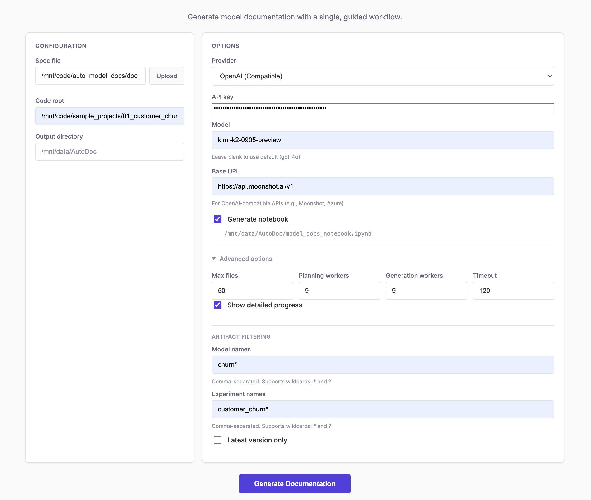
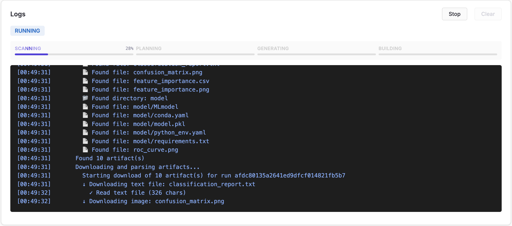
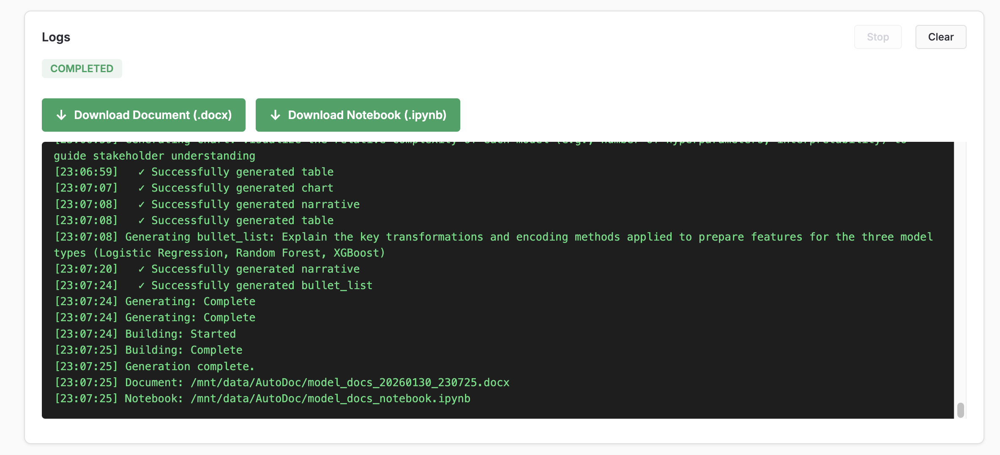
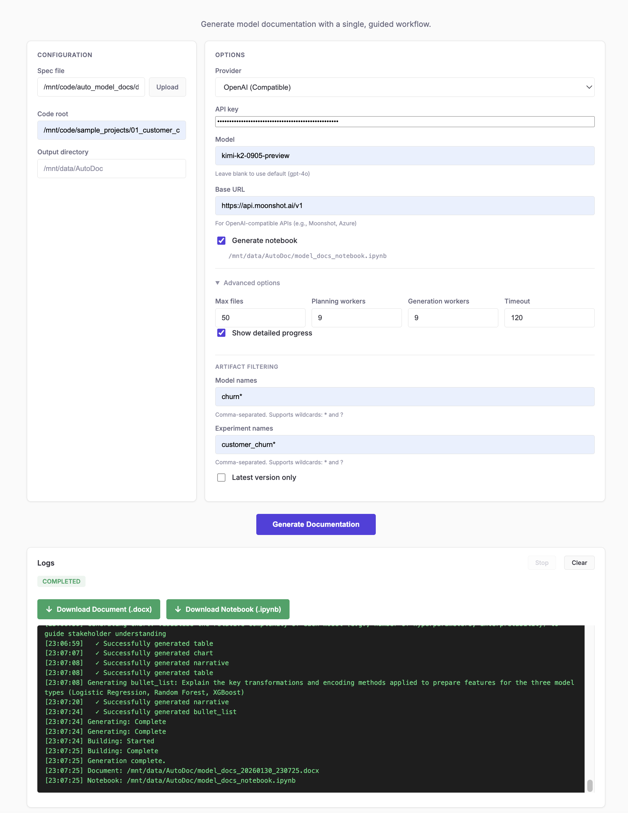

# Auto Model Documentation

A FastHTML app that generates ML model documentation (.docx and .ipynb) from codebases and MLflow artifacts using LLM-powered analysis. Runs as a Domino App with documentation generation dispatched as Domino Jobs, or standalone via CLI.

## Architecture & Design

See [auto_model_docs/README.md](./auto_model_docs/README.md) for the pipeline architecture, scanner stages, Studio UI design, and full configuration reference. Studio design tokens are in [auto_model_docs/DESIGN.md](./auto_model_docs/DESIGN.md).

## Prerequisites

- Python 3.10 or newer
- An Anthropic or OpenAI API key
- MLflow tracking server (optional, only needed for model metadata in generated docs)
- For Domino deployment: a Domino Data Lab workspace with Extended Identity Propagation enabled

## Installation

From the repository root:

```bash
cd auto_model_docs
python -m venv .venv
source .venv/bin/activate
pip install -e ".[dev]"
```

This installs the `autodoc` package along with dev dependencies (pytest, etc.).

## Configuration

Set at least one API key as an environment variable. Any of these work:

```bash
# Option 1: export in your shell
export ANTHROPIC_API_KEY=sk-ant-...

# Option 2: inline per command
ANTHROPIC_API_KEY=sk-ant-... python main.py --spec doc_spec.yaml

# Option 3: use a .env file (optional)
cp .env.example .env
```

Common optional variables:

```bash
LLM_PROVIDER=anthropic              # or openai (default: anthropic)
LLM_MODEL=claude-sonnet-4-20250514  # override the provider default
MLFLOW_TRACKING_URI=http://localhost:5000
CODE_ROOT=/path/to/your/ml/project  # default: /mnt/code or current dir
```

Any variable can be prefixed with `AUTODOC_` for namespace isolation (e.g. `AUTODOC_LLM_PROVIDER`). Full configuration reference lives in [auto_model_docs/README.md](./auto_model_docs/README.md#configuration).

## Usage

### Web UI (Studio)

Studio is the primary interface. Run it locally:

```bash
cd auto_model_docs
python web_app_studio.py
# Open http://localhost:8888
```

The UI is a 3-column FastHTML app: spec file selection, run configuration (branch, hardware tier, advanced settings), and job history. When running locally the job history and dataset browser features require a Domino backend; without one, use the CLI.

### Domino deployment

The app is designed to run as a Domino App with Extended Identity Propagation enabled. The startup script is `auto_model_docs/app_studio.sh`.

1. In your Domino project, set the App command to `auto_model_docs/app_studio.sh`.
2. Set the following environment variables on the App:
   - `DOMINO_API_HOST` (required) -- Domino API host URL
   - `ANTHROPIC_API_KEY` or `OPENAI_API_KEY` (required)
   - `AUTODOC_MAX_JOBS` (optional, default: 1) -- max concurrent jobs per user
3. Start the App. Access it with `?projectId=<target-project-id>` appended to the URL. All specs, jobs, output, and history live in the target project's `autodoc` dataset; the App project only hosts the process.

Documentation generation runs as a separate Domino Job in the target project, so the App container only needs FastHTML plus the Domino client libraries.

### CLI

The CLI is useful for local runs, scripted generation, and regenerating notebooks from cached results.

```bash
cd auto_model_docs
python main.py --spec doc_spec.yaml
```

Common flags:

| Flag | Description |
|---|---|
| `--spec`, `-s` | Path to YAML spec (required) |
| `--provider`, `-p` | `anthropic` or `openai` (CLI default: `openai`) |
| `--model`, `-m` | Model name override |
| `--code-root`, `-c` | Directory to scan (default: `/mnt/code` or `.`) |
| `--notebook` | Also generate an editable Jupyter notebook |
| `--notebook-from-cache` | Regenerate notebook from cached results (skips LLM calls) |
| `--models` | Comma-separated model name patterns (supports `*` wildcards) |
| `--latest-only` | Only include the latest version of each model |
| `--verbose`, `-v` | Verbose logging |

Example spec file (`doc_spec.yaml`):

```yaml
title: "Model Documentation"
authors: "Data Science Team"
sections:
  - "Executive Summary"
  - "Data Overview"
  - "Feature Engineering"
  - "Model Performance: per_model"   # one subsection per registered model
  - "Deployment Considerations"

hints:
  "Executive Summary": >
    Focus on business impact and key metrics.
    Keep it suitable for non-technical stakeholders.
```

<<<<<<< HEAD
Output is written to `output/` by default (or `/mnt/data/{project}` under Domino).

## Sample Projects

Three demo ML projects with MLflow integration live under [`sample_projects/`](sample_projects/). Each project includes data generation, training scripts, and MLflow experiment tracking so you can produce realistic input for the documentation pipeline:

```bash
cd sample_projects/01_customer_churn
pip install -r requirements.txt
python train.py --generate-data
```

See [sample_projects/README.md](./sample_projects/README.md) for the full walkthrough.

## Testing

Two test suites cover the codebase:

```bash
# Core library tests (scanning, generation, LLM client, config)
python -m pytest auto_model_docs/tests/

# Studio and Domino integration tests
python -m pytest tests/
```

Run both with coverage:

```bash
python -m pytest auto_model_docs/tests/ tests/ --cov=auto_model_docs
```
=======
### 4. Run

**CLI:**

```bash
cd auto_model_docs
python main.py --spec doc_spec.yaml --provider openai
```

**Web UI (Studio):**

```bash
cd auto_model_docs
python web_app_studio.py
# Open http://localhost:8888
```

The generated document will be saved to the `output/` directory.

## CLI Reference

```
python main.py --spec <YAML> [OPTIONS]
```

| Option | Short | Description |
|---|---|---|
| `--spec` | `-s` | Path to YAML document specification (required) |
| `--provider` | `-p` | LLM provider: `anthropic` or `openai` (default: `openai`) |
| `--model` | `-m` | Model name override (e.g. `gpt-4o`, `claude-sonnet-4-20250514`) |
| `--code-root` | `-c` | Root directory of the ML codebase to analyze |
| `--output` | `-o` | Output directory for generated documents |
| `--notebook` | | Also generate an editable Jupyter notebook |
| `--notebook-from-cache` | | Regenerate notebook from cached results (skips full pipeline) |
| `--notebook-path` | | Custom path for the generated notebook |
| `--experiments` | | Comma-separated experiment name patterns (supports `*` and `?` wildcards) |
| `--models` | | Comma-separated model name patterns (supports wildcards) |
| `--latest-only` | | Only include the latest version of each model |
| `--generation-workers` | `-w` | Parallel content generation workers (default: 4) |
| `--planning-workers` | | Parallel section planning workers (default: 4) |
| `--max-files` | | Maximum number of source files to scan (default: 50) |
| `--timeout` | | Timeout per LLM API call in seconds (default: 120) |
| `--max-retries` | | Max retries for LLM requests |
| `--initial-backoff` | | Initial backoff delay in seconds |
| `--max-backoff` | | Maximum backoff delay in seconds |
| `--backoff-jitter` | | Random jitter factor applied to backoff |
| `--disable-project-filtering` | | Disable automatic Domino project filtering (scan all projects) |
| `--verbose` | `-v` | Enable verbose logging |

### Examples

```bash
# Generate docs with Anthropic Claude
python main.py -s doc_spec.yaml -p anthropic

# Generate docs + notebook, filtering to specific models
python main.py -s doc_spec.yaml --notebook --models "churn_*" --latest-only

# Quickly regenerate notebook from cache (no LLM calls)
python main.py -s doc_spec.yaml --notebook-from-cache

# Use a custom OpenAI-compatible endpoint
OPENAI_BASE_URL=http://localhost:8080/v1 python main.py -s doc_spec.yaml -p openai
```

## Web UI

The web interface provides form-based configuration, real-time progress monitoring, log streaming, and file downloads.

<p align="center">
  
  
  
  
</p>

```bash
python web_app_studio.py
```


## Configuration Reference

All settings can be set via environment variables, a `.env` file, or CLI flags. Variables can optionally be prefixed with `AUTODOC_` for namespace isolation.

| Variable | Default | Description |
|---|---|---|
| `LLM_PROVIDER` | `openai` | LLM provider (`anthropic` or `openai`) |
| `LLM_MODEL` | Provider default | Model name override |
| `ANTHROPIC_API_KEY` | — | Anthropic API key |
| `OPENAI_API_KEY` | — | OpenAI API key |
| `OPENAI_BASE_URL` | — | Custom OpenAI-compatible endpoint URL |
| `CODE_ROOT` | `/mnt/code` or `.` | Codebase root directory |
| `OUTPUT_DIR` | `/mnt/data/{project}` or `./output` | Output directory |
| `MLFLOW_TRACKING_URI` | — | MLflow tracking server URI |
| `MAX_FILES` | `50` | Max Python files to scan (1-200) |
| `MAX_FILE_SIZE` | `15000` | Max file size in characters |
| `PARALLEL_WORKERS` | `4` | Content generation workers |
| `CACHE_ENABLED` | `true` | Enable LLM response caching |

## Sample Projects

Three realistic ML projects are included for testing under [`sample_projects/`](sample_projects/):

| Project | Task | Models |
|---|---|---|
| `01_customer_churn` | Binary classification (10K samples) | Logistic Regression, Random Forest, XGBoost |
| `02_price_prediction` | Regression (8K samples) | Ridge, Gradient Boosting, Neural Network |
| `03_fraud_detection` | Imbalanced classification (50K samples) | Random Forest, XGBoost, LightGBM, Ensemble |

To run them:

```bash
cd sample_projects

# Start a local MLflow server if running locally
mlflow server --backend-store-uri sqlite:///mlflow.db --default-artifact-root ./mlruns --port 5000 &

# Train all three projects (creates 9 experiments, 10 model versions)
cd 01_customer_churn && python train.py --generate-data && cd ..
cd 02_price_prediction && python train.py --generate-data && cd ..
cd 03_fraud_detection && python train.py --generate-data && cd ..

# Generate documentation
cd ../auto_model_docs
python main.py -s doc_spec.yaml -p openai --notebook -v
```

## Project Structure

```
auto_model_docs/
├── main.py                  # CLI entry point
├── web_app_studio.py        # FastHTML web UI (Studio)
├── doc_spec.yaml            # Example document specification
├── domino_auth.py           # Shared Domino API host + auth resolution
├── domino_client.py         # Domino API client (jobs, projects, branches)
├── domino_datasets.py       # Domino Datasets API client (browse, upload)
├── domino_job_store.py      # SQLite job history (per-project)
├── spec_store.py            # Spec file persistence
├── auth_context.py          # Per-request JWT forwarding via ContextVar
├── studio/                  # Studio UI package
│   ├── state.py             # Shared mutable state, dataclasses, helpers
│   ├── job_engine.py        # Job submission, command building, background polling
│   ├── routes_api.py        # API routes (branches, tiers, datasets, language detection)
│   ├── routes_job.py        # Job routes (run, stop, history)
│   ├── routes_spec.py       # Spec routes (validate, save, list, delete)
│   ├── ui_components.py     # FT component helpers (forms, status panels, tables)
│   ├── styles.py            # CSS generation
│   └── scripts.py           # JS generation
├── autodoc/
│   ├── orchestrator.py      # 4-phase pipeline coordinator
│   ├── core/
│   │   ├── config.py        # Pydantic settings (env vars)
│   │   ├── models.py        # Domain models (CodeContext, ArtifactContext, etc.)
│   │   └── exceptions.py    # Custom exceptions
│   ├── scanning/
│   │   ├── code_scanner.py  # Two-pass code analysis (Python, R, SAS, MATLAB)
│   │   ├── artifact_scanner.py  # MLflow metadata extraction
│   │   ├── file_card.py     # Source file extraction and language detection
│   │   └── sanitizer.py     # Secret removal before LLM calls
│   ├── generation/
│   │   ├── planner.py       # Section content planning
│   │   ├── generator.py     # Content generation (narratives, tables, charts, lists)
│   │   ├── builder.py       # Word document assembly
│   │   ├── notebook_builder.py   # Jupyter notebook generation
│   │   ├── notebook_exporter.py  # Notebook export and execution
│   │   └── citations.py     # Citation management
│   └── llm/
│       ├── client.py        # Unified LLM client (Anthropic/OpenAI)
│       ├── cache.py         # Response caching
│       └── prompts.py       # Prompt templates
├── tests/                   # Unit tests (pytest)
sample_projects/             # 3 demo ML projects with MLflow integration
diagrams/                    # Screenshots and workflow diagrams
```

## Testing

```bash
# Install dev dependencies
pip install -e ".[dev]"

# Run tests
python -m pytest tests/

# Run with coverage
python -m pytest tests/ --cov=auto_model_docs --cov-config=auto_model_docs/pyproject.toml --cov-report=term-missing
```

## License

MIT
>>>>>>> c2ae8f7 (init repo)
