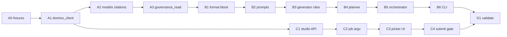

# Task Brief: Bundle Evidence Support

**Canonical spec:** `docs/governance-context/governance-context-handover.md` (citations, `GovernanceContext`, prompts, Job tasks). This brief adds product context, API notes, and the **bundle selection** rules agreed with Subir (model page vs project sidebar).

## 1. What is bundle evidence?

In Domino Governance, a **bundle** links a set of governance policies to a specific
project resource (e.g. a model version or app). **Evidence** is the collection of
structured Q&A answers required to satisfy each policy stage in the bundle.

Key field: `evidenceRestricted: bool` on a bundle. When true, evidence answers and
policy configuration are locked.

## 2. Feature specification

### 2.1 Governance context in generated docs

One **governing bundle per document run**. The Job loads that bundle by UUID and
threads facts through generation as **citable** ground truth (`[@governance.*]`,
`[@evidence.*]`, `[@finding.*]`), same pattern as code/MLflow. No dedicated
Evidence/Findings doc sections; weave into existing sections per handover §7.

Per bundle include:

- **Bundle metadata** - name, policy, stage, state, classification (`classificationValue`)
- **Evidence** - latest answer per question (`isLatest` on compute-policy results; not drafts)
- **Findings** - `open` scope = status **`"To do"`** only (confirmed). Optional `all` via spec/CLI later.

See handover §7 for prompt block, anti-fabrication, token budget, and conflict rules.

### 2.2 Bundle resolution (Studio / extension, then Job by UUID)

**`--bundle-id` is the bundle UUID** (e.g. `a1b2c3d4-...`), passed on the autodoc Job
command for auditability (job log: bundle X produced doc Y). The Job does **not**
auto-discover bundles during orchestrator scan.

Selection happens **before** the Job starts, in the Model Docs extension, based on
launch context:

| Launch context | What we know | Bundle selection |
|----------------|--------------|------------------|
| **Model page** | `modelId` query param on the app URL (e.g. `?projectId=...&modelId=test`). **`modelId` is the model name** (registered name string), not an opaque Domino hex id — use it to match governance attachments. | List project bundles, filter where `attachments[type=ModelVersion].identifier.name == modelId`. **1 match** → auto-select silently. **Multiple** (e.g. fair lending + credit risk) → **minimal picker** (policy + stage; show bundle `state` if not Active). **0 matches** → fall back to full project list (sidebar flow). |
| **Project sidebar** | `projectId` only (no `modelId`) | Full project bundle list; user must pick one when bundles exist. Show **state** on each option (Active, Archived, Complete). |

**When is governance required?**

- List bundles for the project (`projectId[]`).
- **If the list is empty** → no governance for this run; job may start **without** `--bundle-id` (model/project may simply not be governed).
- **If the list is non-empty** → user **must** resolve exactly one bundle UUID before the job starts. No silent skip. If resolution fails (API error, user abandons picker, ambiguous multi-policy case not chosen) → **do not submit the job**.

Common rules:

- Sort: Active first, then `createdAt` descending. **Non-active bundles are allowed**; picker labels and helper text must show `state` (inline note when not Active).
- **One doc = one bundle** (never merge two bundles in one run).
- Match attachment on **`identifier.name`** vs `modelId` in v1 (not `identifier.version`); show version in picker labels for awareness.
- List API hard failure when bundles are required: block job submit with error.

Job side (only after Studio resolved `--bundle-id`):

1. `load_governance_context(bundle_id, findings_scope)` — orchestration in `governance_read.py`; HTTP in `domino_client.py` (see §2.4).
2. Single `GovernanceContext` on every `GenerationContext` for PLAN + GENERATE.

`--bundle-id` omitted: allowed only when the project has **no** governance bundles, or non-Studio/test callers.

### 2.3 Endpoints we use (v1)

Do not treat every path in the handover or §4 catalog as required. **v1 reads:**

| Step | Method | Path | Notes |
|------|--------|------|--------|
| Studio list / filter | `GET` | `/api/governance/v1/bundles?projectId[]={projectId}` | Paginate until exhausted. Bundle metadata + `policyId` + `attachments` come from list entries — **no** separate `GET /bundles/{id}` for selection. |
| Job evidence | `POST` | `/api/governance/v1/rpc/compute-policy` | Body `{bundleId, policyId}`; `policyId` from the chosen list row. |
| Job findings | `GET` | `/api/governance/v1/bundles/{bundleId}/findings` | Filter to `status == "To do"` for default open scope. |

Add or change endpoints in `domino_client.py` as needed; the handover is wrong where it implies other bundle-by-id metadata flows are mandatory.

### 2.4 Model page: `modelId` and attachment matching (answered)

**Decision:** Studio reads `modelId` from the extension URL and filters governance bundles with  
`attachments[type=ModelVersion].identifier.name === modelId`.  
`modelId` is the **MLflow registered model name**, not a Domino ObjectId/UUID.

| Source | What `modelId` is | Verified |
|--------|-------------------|----------|
| Domino extension mount (`modelDetails`) | Contextual query param from platform (`extensions-public-api.yaml`: `ContextualQueryParam` enum includes `modelId`, `modelVersionId`) | MCP 2026-06-04 on biradocg128969 |
| Model card link | `.../extension?mountPointType=modelDetails&...&modelId=mlflow3-logged-and-registered1&modelVersionId=1&projectId=6a21c81b3bff9f0d3ae561b1` | Same string as `/model-registry/mlflow3-logged-and-registered1/...` path segment |
| Dual-bundle test model | `modelId=mlflow3-mixed-logged-and-registered1` on mixed model card | Matches seed layout (2 bundles) |
| Project sidebar mount | `projectId` only — **no** `modelId` | `mountPointType=projectSidebar` link has no model params |
| Governance attachment | `identifier.name` on `ModelVersion` attachments | Seed: `"mlflow3-logged-and-registered1"` etc. (`how-to-governance.md`) |
| Job MLflow scan | `ModelInfo.name` = `rm.name` from `MlflowClient.get_registered_model` / `search_model_versions` | `artifact_scanner.py` (`name=rm.name`) |

**Also on URL (do not use for bundle filter in v1):** `modelVersionId` (e.g. `1`) — available for future version-scoped bundles; bundle filter is **name only**.

**Studio implementation (C1):**

```javascript
const modelId = new URLSearchParams(location.search).get('modelId'); // null on sidebar launch
// filter: att.type === 'ModelVersion' && att.identifier?.name === modelId
```

**APIs for bundle filter (Studio):** `GET /api/governance/v1/bundles?projectId[]={projectId}` (paginated). No per-model API; filter client-side.

**APIs for Job-side name consistency (after submit):** MLflow via `ArtifactScanner` / `MlflowClient` in project (`mlflow.domino.project_id` tag on experiments). Scanned `ModelInfo.name` should equal `modelId` when documenting that model.

**Multi-policy picker test model:** `mlflow3-mixed-logged-and-registered1` on biradocg128969.

### 2.5 Test data, fixtures, and clusters

**Agent runbook (seed via Chrome MCP):** `agent_automation/how-to-governance.md` (recipes A–I, verified walkthroughs). Index: `agent_automation/README.md`.

**Governance seed cluster (fixtures + manual tests):**

| Item | Value |
|------|--------|
| Cluster | `https://biradocg128969.engineering-dev.domino.tech` |
| Project | `integration-test/modeldocs-target-bgp` |
| `projectId` | `6a21c81b3bff9f0d3ae561b1` |
| Example models | `mlflow3-logged-and-registered1`, `internalqwen`, `mlflow3-mixed-logged-and-registered1` (dual-bundle) |

Example bundle UUIDs from minimal seed (2026-06-04; new seeds get new ids): mlflow3 `7f746bd1-3c88-4d89-97d0-9eba1bfb38b0`, internalqwen `ccc102fc-9781-411e-a5b0-e9cf6277e9f3`. Re-read from UI or list API after re-seed.

**Fixtures (A0):** Save redacted JSON from live calls against biradocg128969 (or export from browser network on bundles list / compute-policy / findings). Suggested files under `auto_model_docs/tests/fixtures/governance/`:

- `bundles-list-modeldocs-target-bgp.json`
- `compute-policy-mlflow3-bundle.json` (submitted results, `isLatest: true`)
- `findings-todo.json` (status `"To do"` per API; UI labels may show `To Do`)

**Findings status (UI glossary in how-to):** `To Do`, `In progress`, `Done`, `Wont fix`. v1 API filter for `open` scope: **`"To do"`** only (engineering decision §8). Confirmed in A0 fixture `findings-todo.json` (API `"To do"`, not UI `To Do`).

**E2E cluster:** `e2e_test_runbook.md` and `deploy.md` use **biradocg128969** / **modeldocs-target-bgp** for publish, deploy, and generate (global app `modeldocs-ext1`). Governance seed and D1 use the same project.

**Deprecated for agents:** `seed-governance-browser.js`, API appendix at bottom of `how-to-governance.md`.

### 2.6 Out of scope (v1)

- Multiple bundles merged into **one** document
- Orchestrator `BundleScanner` auto-attaching bundles at scan time (superseded by §2.2 Studio resolution)
- Draft answers; write-back of docx to bundle; auto-created findings
- Full evidence revision history in the doc

## 3. Service architecture

Two services are involved:

**rai-guardrails-service** (`/Users/biraignacio/Documents/dev/src/rai-guardrails-service`)
- Go, Gin framework, port 8088
- Serves `/api/governance/v1/` - all bundle/evidence/policy/findings CRUD
- Routes: `internal/server/handler.go`
- Domain types: `internal/guardrails.go`

**rai-rules-service** (`/Users/biraignacio/Documents/dev/src/rai-rules-service`)
- Go, net/http, port 8088, base path `/api/v1`
- Access control engine: guardrails-service calls it to enforce policy rules
- Not called directly by the extension

## 4. REST API reference (rai-guardrails-service)

All paths relative to `/api/governance/v1`.

### Bundles

```
GET    /bundles
  ?limit, offset, projectId[], state[], orderBy, search, policyId[], id[], evidenceRestricted
  -> { data: Bundle[] }

POST   /bundles               body: CreateBundle   -> Bundle
GET    /bundles/{id}                               -> Bundle
PATCH  /bundles/{id}          body: UpdateBundle   -> Bundle
DELETE /bundles/{id}

GET    /bundles/{id}/gates                         -> Gate[]
GET    /bundles/{id}/approvals                     -> Approval[]
PATCH  /bundles/{id}/stages/{stageID}
  body: { assignee?: { id, name } }               -> BundleStage

POST   /bundles/{id}/approvals/{approvalId}/revalidation   body: CreateRevalidation -> Approval
PATCH  /bundles/{id}/approvals/{approvalId}/revalidation   body: UpdateRevalidation -> Approval
DELETE /bundles/{id}/approvals/{approvalId}/revalidation                            -> Approval

GET    /bundles/{id}/findings  -> Finding[]
GET    /bundles/{id}/report    -> (download)

POST   /bundles/bulk-update
GET    /attachment-overviews
```

Bundle shape (from `internal/guardrails.go`):
```
ID                   uuid
Name                 string
ProjectID            string
PolicyID             uuid
PolicyVersionID      uuid
PolicyVersion        Version
Stage                string
Stages               []BundleStage
Attachments          []Attachment
Policies             []BundlePolicy
Gates                []Gate
ClassificationValue  *string
StageApprovals       []StageApproval
State                BundleState
EvidenceRestricted   bool
HasRevalidationSchedule bool
CreatedAt            time
CreatedBy            User
```

Attachment shape (for model-launch filtering):
```
Type   string    e.g. "ModelVersion", "App"
ID     string    the attached resource's ID
```

### Findings

```
GET    /bundles/{id}/findings  -> Finding[]
GET    /findings/{id}          -> Finding
POST   /findings               -> Finding
PUT    /findings/{id}          -> Finding
PUT    /rpc/bulk-edit-findings
```

Finding shape (from `internal/guardrails.go`):
```
ID               uuid
BundleID         uuid
ApprovalID       *uuid
PolicyVersionID  uuid
EvidenceID       *uuid
ArtifactID       *uuid
Name             string
Description      *string
Severity         FindingSeverity    ("S1", "S2", ...)
Status           FindingStatus      ("To do", ...)
Assignee         *FindingUser       { id, name }
Approver         *FindingUser       { id, name }
DueDate          *time
CreatedAt        time
CreatedBy        User
```

### Evidence templates

Evidence templates define the Q&A structure (questions, artifact types). Separate
from the answers (which live in Results/Drafts).

```
GET    /evidence-templates               -> EvidenceTemplate[] (paginated)
GET    /evidence-templates/{id}          -> EvidenceTemplate
GET    /evidence-templates/{id}/definition  -> definition YAML
PUT    /evidence-templates/{id}
PUT    /evidence-templates/{id}/definition
PUT    /evidence-templates/{id}/status
DELETE /evidence-templates/{id}
```

EvidenceTemplate shape (from `internal/guardrails.go`):
```
ID               uuid
ExternalID       ExternalID
Name             string
Description      string
Scope            EvidenceScope
PolicyID         uuid
PolicyVersionID  uuid
Artifacts        []EvidenceArtifact    (the questions)
Visible          *bool
VisibilityRule   *string
```

EvidenceArtifact (one question):
```
id            string
artifactType  string    "Input"
details {
  text  string          the question label
  type  string          "Radio"|"Textinput"|"Textarea"|"Numeric"|
                        "Date"|"Checkbox"|"Select"|"Multiselect"
}
```

### Results and Drafts (evidence answers)

Results are submitted/finalized answers. Drafts are in-progress. We use Results.

```
POST   /results               body: CreateResults  -> Result[]
GET    /results               ?bundleId, policyId, ...  -> Result[]
GET    /results/latest        ?bundleId, policyId  -> Result[]   <-- use this

PUT    /drafts                body: UpsertDrafts
GET    /drafts/latest         ?bundleId, policyId  -> Draft[]
```

ArtifactResult shape:
```
evidenceId       uuid
artifactContent  map[artifactId]value   (question ID -> answer value)
```

### Policies

```
GET    /policy-overviews      ?limit, offset, status[], orderBy, search  -> PolicyOverview[]
GET    /policies/{id}                                                     -> Policy
PUT    /policies/{id}
PUT    /policies/{id}/status
GET    /policies/{id}/definition                                          -> PolicyDefinition
PUT    /policies/{id}/definition
GET    /policies/{id}/versions                                            -> PolicyVersionOverview[]
POST   /policies/{id}/versions
DELETE /policies/{id}
```

### Policy Versions

```
GET    /policy-versions/{id}                         -> PolicyVersion
GET    /policy-versions/{id}/definition              -> PolicyVersionDefinition
PUT    /policy-versions/{id}/definition
GET    /policy-versions/{id}/diff/{targetId}         -> PolicyDiffResult
```

### RPC endpoints

```
POST   /rpc/compute-policy
  body: { bundleId, policyId, policyVersionId? }
  -> ComputedPolicy

POST   /rpc/submit-result-to-policy
POST   /rpc/publish-approval-event
POST   /rpc/copy-bundle
POST   /rpc/snapshot-bundle
PUT    /rpc/bulk-edit-findings
POST   /rpc/delete-attachment-and-results
POST   /rpc/update-approval
POST   /rpc/analyze-monitor-model
POST   /rpc/add-policies-to-bundle
PATCH  /rpc/update-bundle-policy
POST   /rpc/publish-policy-version
POST   /rpc/draft-latest-published-policy-version
POST   /rpc/reset-bundle
POST   /rpc/bulk-add-attachments
POST   /rpc/upgrade-bundle-policy
POST   /rpc/replace-bundle-primary-policy
POST   /rpc/diff-bundle-policies
```

### ComputedPolicy - the primary read endpoint

`POST /rpc/compute-policy` is the single call to get all evidence, approvals, and
stage state for a bundle+policy. Shape from `internal/guardrails.go`:

```
ComputedPolicy {
  Bundle          Bundle
  Policy          Policy
  BundleStages    []BundleStage
  Approvals       []ComputedApproval   { Approval, IsUserApprover bool }
  Results         []*ArtifactResult    submitted evidence answers  <-- use this
  Drafts          []*ArtifactDraft     in-progress answers (ignore for now)
  CommentsInfo    CommentsInfo
  FindingsInfo    FindingsInfo         { artifactFindingsCountMap, bundleFindingsCount }
  IsUserApprover  bool
}
```

To reconstruct Q&A pairs, `POST /rpc/compute-policy` is the only call needed:
- `Policy` (inside the response) contains the definition with question text
- `Results` contains the submitted answers keyed by artifact ID
No separate evidence-template lookups required. Confirmed by SME 2026-05-29.

### Nucleus-mounted guardrails controller (`/guardrails`)

Separate Scala service in the `domino` monorepo. Not needed for this feature.
Handles: comments, audit events, bulk-attach flow artifacts, bundle permissions.

## 5. APIs needed for this feature (read-only)

| Call | Purpose |
|---|---|
| `GET /api/governance/v1/bundles?projectId[]=<id>` | List bundles for project; filter in code by model attachment |
| `GET /api/governance/v1/bundles/{id}` | Bundle metadata + attachments (for model-launch filtering). Does NOT include evidence questions or answers. |
| `POST /api/governance/v1/rpc/compute-policy` `{bundleId, policyId}` | Both the policy definition (question text) AND the submitted answers (`Results`). Single call — no separate evidence-template lookups needed. |
| `GET /api/governance/v1/bundles/{id}/findings` | Findings list |

## 6. Key source files

| Repo | File | Contents |
|---|---|---|
| rai-guardrails-service | `internal/server/handler.go` | Route definitions |
| rai-guardrails-service | `internal/server/composite.go` | compute-policy handler |
| rai-guardrails-service | `internal/server/bundle.go` | bundle handlers |
| rai-guardrails-service | `internal/server/finding.go` | finding handlers |
| rai-guardrails-service | `internal/server/result.go` | result handlers |
| rai-guardrails-service | `internal/server/evidence_template.go` | evidence template handlers |
| rai-guardrails-service | `internal/guardrails.go` | all domain types |
| frontend-web-ui-service | `packages/core/src/api-client/clients/govern/fetchers/` | TS API clients |
| frontend-web-ui-service | `packages/ui/src/govern/governance.api.ts` | API client instantiation |
| frontend-web-ui-service | `packages/ui/src/govern/contexts/PolicyRpcProvider.tsx` | compute-policy usage |
| frontend-web-ui-service | `packages/ui/src/govern/project/FindingsPage/` | findings UI |

## 7. Where changes go in this repo

| What | File |
|---|---|
| Canonical design | `docs/governance-context/governance-context-handover.md` |
| Typed models + citations | `autodoc/core/models.py`, `autodoc/generation/citations.py` |
| Governance HTTP | `auto_model_docs/domino_client.py` — **merge** `governance_client.py` here; **delete** `governance_client.py` |
| Job-side load | `autodoc/governance_read.py` — calls `domino_client` only (no second HTTP client) |
| List bundles (Studio) | `domino_client.list_governance_bundles`, `studio/routes_api.py`, `studio/ui_components.py`, `studio/job_engine.py` |
| Prompts + generator + planner | `autodoc/llm/prompts.py`, `autodoc/generation/generator.py`, `autodoc/generation/planner.py` |
| Orchestrator + CLI | `autodoc/orchestrator.py`, `auto_model_docs/main.py` (`--bundle-id` UUID, `--findings-scope`) |

**Retire / replace on branch:** `BundleScanner` in orchestrator scan phase; uncited
`format_governance_context` + `List[ComputedPolicy]` → handover `GovernanceContext` +
`_format_governance_evidence` + citation resolution.

**Branch spike (reuse, do not treat as done):** `governance_client.py` (merge into `domino_client` then remove), `ComputedPolicy` dataclasses, tests in `tests/test_governance_client.py` — migrate tests to `domino_client` / `governance_read`.

## 8. Product decisions (locked, 2026-06)

| # | Decision |
|---|----------|
| 1 | If the project has **any** bundles, Studio must resolve one UUID before job submit; otherwise **block** (no job start). |
| 2 | Findings `open` scope = **`"To do"`** only. |
| 3 | **Ignore** `GET /bundles/{id}` for v1; use list row + compute-policy + findings. Handover endpoint list is not authoritative. |
| 4 | **Merge** `governance_client.py` into `domino_client.py`; delete `governance_client.py`. |
| 5 | **`modelId`** = MLflow registered model **name**; filter `identifier.name`; sidebar has no `modelId` — §2.4 (verified MCP + platform API). |
| 6 | **Non-active** bundles allowed; picker shows **state** + inline note when not Active. |
| 7 | Governance **required only when bundles exist**; zero bundles → job without `--bundle-id` is OK. |

## 9. Confirmed decisions (SME + engineering)

- `POST /rpc/compute-policy` returns policy definition (questions) and submitted answers; filter results with `isLatest == true`.
- Evidence/findings are not on the bundle list response alone; Job loads via compute-policy + findings endpoints (§2.3).
- Citations: reuse existing machinery with `governance.` / `evidence.` / `finding.` prefixes (handover §7.1).

## 10. What NOT to do

- Do not call any write endpoints (drafts, results, comments, audit events).
- Do not guess JSON field names - verify against `internal/guardrails.go` or a live response.
- Do not add a new HTTP client - use `_domino_request()` from `domino_client.py`.
- rai-rules-service is not called directly - it is an internal dependency of rai-guardrails-service.

## 11. Implementation plan (small phases)

Each phase is one reviewable PR. Prompt/citation literals: handover §7. Product rules: §2.2, §8.

**Dependency sketch:** A0 → A1 → A2 → A3 → B1–B4 (B2–B4 need A2) → B5 → B6. C1 ∥ A1+. C2 needs C1. C3–C4 need C2. D1 last.



### A0 — Fixtures from seed cluster

**Scope:** No production behavior change.

- Use seeded project on **biradocg128969** (`how-to-governance.md` constants). Chrome MCP on port 9222.
- Capture/redact JSON fixtures (§2.5): list bundles, compute-policy (`isLatest`), findings.
- Confirm API finding status string matches `"To do"` vs UI `To Do`.
- Optional sanity: one generate on modeldocs-target-bgp; log `modelId` vs scanned `ModelInfo.name` (expected equal; §2.4).
- Comment block in `domino_client.py` listing §2.3 paths.

**Accept:** Fixture files in repo; API status spelling documented; §2.4 MLflow cross-check noted pass/fail.

---

### A1 — Governance HTTP in `domino_client`

**Scope:** Move HTTP only; no orchestrator/Studio yet.

- Move `list_bundles`, `compute_policy`, `get_findings` from `governance_client.py` into `domino_client.py` (`_domino_request`).
- Paginate list bundles until exhausted.
- Delete `governance_client.py`; fix imports; migrate `tests/test_governance_client.py` → `test_domino_client_governance.py` (or equivalent).

**Accept:** All migrated unit tests green; no remaining imports of `governance_client`.

---

### A2 — `GovernanceContext` and citation IDs

**Scope:** Types + citation parsers only.

- Add `EvidenceItem`, `Finding`, `GovernanceContext` per handover §6.2.
- `GenerationContext.governance_context: Optional[GovernanceContext]`.
- `DocumentSpec.governance_findings_scope` (`open` default → `"To do"` only).
- `citations.py`: `build_evidence_citation_id`, `build_finding_citation_id`, `build_governance_citation_id`; extend `parse_citation_id` / `extract_citation_ids`.

**Accept:** New unit tests round-trip all three prefixes; no generator changes yet.

---

### A3 — `governance_read.load_governance_context`

**Scope:** Bundle UUID → typed context; uses A1 + A2.

- New `autodoc/governance_read.py`: join compute-policy Q/A (`artifactType == input`, `isLatest`), normalize `artifactContent` (prefer `value`).
- Findings: `open` → `status == "To do"` only.
- Errors → raise or return explicit failure (caller decides); log bundle id.

**Accept:** Unit tests against A0 fixtures; empty/missing data handled per test cases.

---

### B1 — `_format_governance_evidence` + token budget

**Scope:** String formatting only (no LLM calls).

- `ContentGenerator._format_governance_evidence` per handover §7.1 (grouped evidence, citation tags).
- Token budget helper per §7.4 (truncate answers, cap block, never drop bundle facts/findings; omission notice).

**Accept:** Unit test: fixture `GovernanceContext` → expected block string; over-budget fixture → notice + trimmed evidence.

---

### B2 — Prompt and system strings

**Scope:** `prompts.py` only.

- Add `governance_evidence: str = ""` to four `build_*_prompt` functions.
- Canonical anti-fabrication + conflict paragraph (§7.2 + §7.5).
- System note on `SYSTEM_NARRATIVE_WRITER` (§7.3) when block non-empty.

**Accept:** Prompt tests: with block → clause present; empty → byte-identical to pre-change snapshots.

---

### B3 — Generator: wire block and resolve citations

**Scope:** `generator.py`.

- Call `_format_governance_evidence`; pass `governance_evidence=` into all four generate paths.
- Extend `_collect_citations_for_text/table/chart` for `governance.` / `evidence.` / `finding.`.
- **Remove** branch spike: `format_governance_context`, `system_prompt_with_governance`, `GenerationContext.governance` list.

**Accept:** Test: generated snippet with `[@evidence.foo]` resolves to `Citation`; no references to old helpers.

---

### B4 — Planner governance block

**Scope:** `planner.py` + planning prompt builder.

- Pass same governance block into `build_section_planning_prompt` (or equivalent).
- `GenerationContext` already has `governance_context` from A2.

**Accept:** Planner test or orchestrator mock: planning prompt contains governance block when context set.

---

### B5 — Orchestrator cleanup

**Scope:** `orchestrator.py`.

- `generate(..., governance_context: Optional[GovernanceContext] = None)`.
- Build governance block once (B1 budget); set on every `GenerationContext`.
- **Remove** `BundleScanner` from scan phase and related spike wiring.

**Accept:** `test_orchestrator` updated; scan no longer calls governance APIs.

---

### B6 — CLI `--bundle-id`

**Scope:** `main.py` entry.

- Flags: `--bundle-id` (UUID), optional `--findings-scope` (`open`|`all`).
- When `--bundle-id`: `cli_auth`, `load_governance_context`, pass to orchestrator; **fail job** if load fails.
- When flag absent: unchanged behavior (no governance).

**Accept:** CLI test or script test: without flag no governance load; with flag + mock, orchestrator receives context.

---

### C1 — Studio: `modelId` + list bundles API

**Scope:** Backend route only; minimal UI.

- Parse `modelId` from URL in studio scripts (alongside `projectId`).
- `domino_client.list_governance_bundles(project_id)` with pagination.
- `GET /api/governance/bundles?projectId=` → JSON list for UI.

**Accept:** Manual or test: route returns bundles for project; modelId available in JS helper.

---

### C2 — Job command carries bundle UUID

**Scope:** `job_engine.py`, `state.py`.

- `JobRequest.bundle_id: Optional[str]`.
- `_build_job_command` appends `--bundle-id <uuid>` when set.

**Accept:** Unit test: request with `bundle_id` → command line contains flag and UUID.

---

### C3 — Picker UI (model page + sidebar)

**Scope:** `ui_components.py` (and related).

- Load bundles from C1.
- **Model page** (`modelId` set): filter `identifier.name == modelId`; 1 → hidden selection; N → minimal picker (policy · stage · state); 0 → full list.
- **Sidebar:** full list; every option shows `state`.
- Non-active: selectable with visible state / helper text.

**Accept:** Manual screenshots checklist: three scenarios (1 match, multi-policy, sidebar).

---

### C4 — Submit gate

**Scope:** Generate button / submit path.

- After list: if `bundles.length > 0` and no `bundle_id` resolved → disable Generate + message.
- If `bundles.length === 0` → allow submit without `--bundle-id`.
- On submit: always pass resolved UUID when required.

**Accept:** Manual: project with bundles cannot submit until pick; project without bundles submits.

---

### D1 — End-to-end validation

**Scope:** engineering-dev (or staging).

- Job with `--bundle-id` → docx contains resolvable `[@governance.*]` / `[@evidence.*]`.
- Job log shows bundle UUID.
- Model page auto-select (1 bundle); multi-policy picker; zero-bundle project runs without flag.

**Accept:** Short run log in §13 or ticket; issues filed for gaps.

---

### Superseded plan (branch spike only — do not extend)

The following was implemented on `ddl-bira-ignacio.governance` as an exploration; **replace** per phases above:

<details>
<summary>Old Phase 2 — orchestrator auto-scan (superseded)</summary>

**Goal (obsolete):** Fetch governance during scan with no UI.

#### Background: how the pipeline works

The orchestrator (`auto_model_docs/autodoc/orchestrator.py`) runs a 4-phase pipeline:
1. **Scan** - runs `ArtifactScanner` (MLflow) and `CodeScanner` concurrently
2. **Plan** - calls `SectionPlanner.plan_section()` per section (and per model for `per_model` sections)
3. **Generate** - calls `ContentGenerator.generate()` per content block
4. **Build** - assembles the Word document

After the scan phase (lines ~215-228 in `orchestrator.py`), two context objects exist:
- `artifact_ctx: ArtifactContext` - contains `artifact_ctx.models: List[ModelInfo]`
  - each `ModelInfo` has `.name` (the MLflow registered model name) and `.version`
- `code_ctx: CodeContext` - contains code analysis results

Both `artifact_ctx` and `code_ctx` are passed into `GenerationContext` at planning and
generation time. `GenerationContext` is what flows into every LLM call.

The project ID is available as `os.environ["DOMINO_PROJECT_ID"]` (already required and
validated in `main.py` before any work begins).

#### What to build

**Step 1: Add `governance` field to `GenerationContext`**

In `auto_model_docs/autodoc/core/models.py`, add an optional field to
`GenerationContext`:

```python
@dataclass
class GenerationContext:
    code_context: CodeContext
    artifact_context: ArtifactContext
    section_name: str
    model_name: Optional[str] = None
    model_run_id: Optional[str] = None
    hint: Optional[str] = None
    language: str = "python"
    governance: List["ComputedPolicy"] = field(default_factory=list)  # NEW
```

`governance` is a list because a project can have multiple bundles that each match a
different model. Each element is a `ComputedPolicy` (already defined in Phase 1).

#### What `governance_data` contains

Single variable in `Orchestrator.generate()`: `governance_data: List[ComputedPolicy]`.
Built once after MLflow/code scans; the same list is passed into `_plan_all_sections`
and `_generate_all_content`, then copied onto each `GenerationContext.governance`
( not filtered per section or per model today).

| Field on each `ComputedPolicy` | Source | Used for |
|---|---|---|
| `bundle` | `compute-policy` response `bundle` | name, stage, state, classification, evidence_restricted (when present) |
| `policy_id`, `policy_name` | `compute-policy` response `policy` | policy label in docs |
| `policy_stages` | `policy.stages` (raw dicts) | question text via `evidenceSet[].artifacts[]` where `artifactType == "input"` |
| `results` | `compute-policy` `results` with `isLatest == true` only | answers; match `evidenceId` + `artifactId` to artifacts |
| `findings` | `GET /bundles/{id}/findings` | name, severity, status, description, assignee |

Empty list when: no `DOMINO_PROJECT_ID`, no MLflow models scanned, no matching bundles,
or all API calls fail (best-effort; pipeline continues).

**Step 2: Add `BundleScanner` and call it from `Orchestrator.generate()`**

Implement `auto_model_docs/autodoc/scanning/bundle_scanner.py` with class `BundleScanner`:

- `scan_for_models(model_names, project_id)` — sync; filters `state == "Active"`,
  matches `ModelVersion` attachment names, calls `compute_policy` + `get_findings`.
- `scan(models)` — async wrapper via `asyncio.to_thread`.

In `orchestrator.py`, after artifact and code scans complete:

```python
governance_data = await self.bundle_scanner.scan(artifact_ctx.models or [])
```

Helpers `bundle_matches_models` and `ACTIVE_BUNDLE_STATE` live in `bundle_scanner.py`,
not in the orchestrator.

Note: governance client calls are synchronous; `BundleScanner.scan` offloads to a thread.
Failures return empty/None from the client; the pipeline continues without governance data.

**Step 3: Update `ComputedPolicy` dataclass to carry findings**

In `auto_model_docs/autodoc/core/models.py`, add a `findings` field to
`ComputedPolicy`:

```python
@dataclass
class ComputedPolicy:
    bundle: BundleSummary
    policy_id: str
    policy_name: str
    policy_stages: List[Dict[str, Any]]
    results: List[ArtifactResult]
    findings: List[GovernanceFinding] = field(default_factory=list)  # NEW
```

**Step 4: Thread `governance_data` into `GenerationContext`**

In `orchestrator.py`, pass `governance_data` when building `GenerationContext` in
both `_plan_all_sections` and `_generate_all_content`:

```python
context = GenerationContext(
    code_context=code_ctx,
    artifact_context=artifact_ctx,
    section_name=section.name,
    model_name=...,
    model_run_id=...,
    hint=...,
    governance=governance_data,  # NEW
)
```

The `governance_data` list is computed once in `generate()` and passed down. Both
`_plan_all_sections` and `_generate_all_content` must accept it as a parameter.

**New arguments**: None. The project ID comes from `DOMINO_PROJECT_ID` env var which
is already required. Model names come from `artifact_ctx.models` already scanned.

**What to add to `Orchestrator.__init__`**: Nothing. Governance is fetched per-run
inside `generate()`, not stored on the instance.

**Output of this phase**: `GenerationContext.governance` is populated with
`ComputedPolicy` objects (each containing bundle metadata, policy stages with
evidence questions, submitted answers, and findings) and flows to every LLM call.

Old Phase 3 delivered uncited `format_governance_context` on the branch (replace with handover cited block).

</details>

**Spike delivered on branch (reuse, then replace):** `governance_client.py`, `BundleScanner`,
`ComputedPolicy` list on `GenerationContext`, uncited prompts, tests — see checkpoint below.

---

## 12. Important implementation notes

### Model page URL params (Domino `modelDetails` mount)

- `mountPointType=modelDetails`, `extensionId`, `projectId`, **`modelId`**, **`modelVersionId`** — see §2.4.
- **`modelId`** = MLflow registered model name (verified on model card link). Not a UUID.
- **`modelVersionId`** = version (e.g. `1`); show in UI if useful; not used for bundle filter in v1.
- Sidebar mount: `projectId` only (no `modelId`).

### Attachment identifier shape

For `ModelVersion` attachments, `identifier` is `{"name": "<model_name>", "version": <int>}`.
Studio filter: `identifier.name == modelId`. Version in picker labels only in v1.

### CLI `--bundle-id`

Bundle **UUID** on the job command. Studio appends after resolution. Omitted only when project has **no** bundles or non-Studio tests.

### Studio gate vs Job load

- **Studio:** bundles exist → must pick one or block submit (§8).
- **Job:** with `--bundle-id`, governance load should **fail the run** if compute-policy/findings cannot be loaded (do not produce an MRM doc that silently lacks governance).

### `compute_policy` request body

```json
{"bundleId": "<uuid>", "policyId": "<uuid>"}
```

`policyId` from the selected row in `GET .../bundles?projectId[]=...` (not a separate bundle GET).

### Evidence answer shape

Normalize `artifactContent` in `governance_read` (prefer `value` key; fallbacks per handover §6.1b).

### Product clarification (Subir + engineering, 2026-06)

- Model page + one matching bundle → **silent** auto-select (no picker).
- Same model, multiple **policies** → minimal picker (policy + stage); show non-Active **state** on options.
- Project sidebar → full bundle list with **state** visible.
- `--bundle-id` kept for **auditability** in job logs.
- Bundles exist → resolve or **no job**; no bundles → OK without governance.

## 13. Checkpoint

**Spike (branch — superseded architecture):**

- [x] API client + dataclasses + tests
- [x] Orchestrator `BundleScanner` + uncited prompt injection

**Target (§11 small phases):**

- [x] A0 fixtures + modelId check
- [x] A1 domino_client governance HTTP
- [x] A2 GovernanceContext + citation IDs
- [x] A3 governance_read
- [x] B1 format block + token budget
- [x] B2 prompts
- [x] B3 generator + citations
- [x] B4 planner
- [x] B5 orchestrator (drop BundleScanner)
- [x] B6 CLI `--bundle-id`
- [ ] C1 Studio list API + modelId parse
- [ ] C2 job command
- [ ] C3 picker UI
- [ ] C4 submit gate
- [ ] D1 E2E validation

---

## 14. API response samples (from actual Go structs)

These are concrete samples derived from the Go source structs in
`rai-guardrails-service`. Field names are exact — do not guess alternatives.

### GET /api/governance/v1/bundles?projectId[]=proj-123

```json
{
  "data": [
    {
      "id": "a1b2c3d4-0000-0000-0000-000000000001",
      "name": "Churn Model Bundle",
      "createdAt": "2026-01-15T10:30:00Z",
      "createdBy": { "id": "usr-1", "firstName": "Alice", "lastName": "Chen", "userName": "alice.chen" },
      "policyId": "f0e1d2c3-0000-0000-0000-000000000010",
      "policyVersionId": "f0e1d2c3-0000-0000-0000-000000000011",
      "policyVersion": "1.2",
      "policyName": "Credit Risk Model Policy",
      "projectId": "proj-123",
      "projectName": "Credit Risk",
      "projectOwner": "alice.chen",
      "stage": "Stage 1",
      "state": "Active",
      "evidenceRestricted": false,
      "classificationValue": "High",
      "attachments": [
        {
          "id": "att-0001",
          "type": "ModelVersion",
          "identifier": { "name": "churn-model", "version": 3 },
          "source": "DFS",
          "createdAt": "2026-01-15T10:30:00Z",
          "createdBy": { "id": "usr-1" }
        }
      ],
      "currentStageInfo": {
        "status": "InProgress",
        "openFindingsCount": 2,
        "pendingApprovalsCount": 1
      }
    }
  ],
  "meta": {
    "filters": [],
    "search": null,
    "pagination": { "offset": 0, "limit": 25, "totalCount": 1 },
    "sort": []
  }
}
```

Key points:
- Response is `{"data": [...], "meta": {...}}` — NOT a bare array.
- `attachments[].identifier` for `type == "ModelVersion"` is `{"name": "<mlflow_model_name>", "version": <int>}`. Filter on `identifier["name"]`.
- `policyId` on the bundle is what you pass to `compute_policy`.
- `state` enum: `"Active"`, `"Archived"`, `"Complete"`.

---

### POST /api/governance/v1/rpc/compute-policy

Request body: `{"bundleId": "...", "policyId": "..."}`

```json
{
  "bundle": { "id": "a1b2c3d4-...", "name": "Churn Model Bundle", "state": "Active", "stage": "Stage 1" },
  "policy": {
    "id": "f0e1d2c3-0000-0000-0000-000000000010",
    "name": "Credit Risk Model Policy",
    "description": "Policy for credit risk models",
    "archived": false,
    "status": "Active",
    "enforceSequentialOrder": true,
    "allowProjectApprovers": false,
    "stages": [
      {
        "id": "stage-uuid-1",
        "policyEntityId": "f0e1d2c3-...",
        "name": "Stage 1",
        "policyVersionId": "f0e1d2c3-...",
        "notifyOnTransition": true,
        "evidenceSet": [
          {
            "id": "ev-uuid-1",
            "externalId": "ev-ext-1",
            "name": "Model Training Documentation",
            "description": "Evidence of training process",
            "createdAt": "2026-01-01T00:00:00Z",
            "scope": "Bundle",
            "policyId": "f0e1d2c3-...",
            "policyVersionId": "f0e1d2c3-...",
            "artifacts": [
              {
                "id": "art-uuid-1",
                "policyEntityId": "ev-uuid-1",
                "required": true,
                "artifactType": "input",
                "details": {
                  "text": "Was the model validated on a hold-out dataset?",
                  "type": "Radio",
                  "options": ["Yes", "No", "Partially"]
                }
              },
              {
                "id": "art-uuid-2",
                "policyEntityId": "ev-uuid-1",
                "required": false,
                "artifactType": "input",
                "details": {
                  "text": "Describe the validation methodology.",
                  "type": "Text"
                }
              }
            ]
          }
        ]
      }
    ]
  },
  "results": [
    {
      "id": "result-uuid-1",
      "evidenceId": "ev-uuid-1",
      "bundleId": "a1b2c3d4-...",
      "artifactId": "art-uuid-1",
      "artifactContent": { "value": "Yes" },
      "createdAt": "2026-02-10T14:00:00Z",
      "createdBy": { "id": "usr-1", "firstName": "Alice", "lastName": "Chen", "userName": "alice.chen" },
      "isLatest": true
    },
    {
      "id": "result-uuid-2",
      "evidenceId": "ev-uuid-1",
      "bundleId": "a1b2c3d4-...",
      "artifactId": "art-uuid-2",
      "artifactContent": { "value": "We used a stratified 80/20 train-test split with 5-fold CV on the training set." },
      "createdAt": "2026-02-10T14:02:00Z",
      "createdBy": { "id": "usr-1", "firstName": "Alice", "lastName": "Chen", "userName": "alice.chen" },
      "isLatest": true
    }
  ],
  "drafts": [],
  "commentsInfo": { "bundleCommentsCount": 3, "artifactCommentsCountMap": {}, "approvalCommentsCountMap": {} },
  "findingsInfo": { "bundleFindingsCount": 2, "artifactFindingsCountMap": {}, "approvalFindingsCountMap": {}, "approvalFindingsMap": {} },
  "approvals": [],
  "bundleStages": [],
  "isUserApprover": false
}
```

Key points:
- Questions are in `policy.stages[*].evidenceSet[*].artifacts[*].details["text"]`.
  Only `artifactType == "input"` artifacts carry question text.
- Answers are in `results[*].artifactContent` — this is `map[string]any`, always
  has a `"value"` key. For text: `{"value": "some string"}`. For radio/checkbox:
  `{"value": "Yes"}`. Use `content.get("value", content)` not `str(content)`.
- Match question to answer: `result.evidenceId == evidence.id AND result.artifactId == artifact.id`.
  Both sides are UUIDs; compare as strings with `str(...)`.
- Only use results where `isLatest == true`.
- `policy_stages` in the Python `ComputedPolicy` dataclass maps to `policy.stages`
  in this response (parsed in `governance_client.compute_policy` as `policy_raw.get("stages")`).

---

### GET /api/governance/v1/bundles/{id}/findings

```json
{
  "data": [
    {
      "id": "find-uuid-1",
      "bundleId": "a1b2c3d4-...",
      "approvalId": null,
      "approvalName": "",
      "artifactLabel": "Was the model validated on a hold-out dataset?",
      "policyId": "f0e1d2c3-...",
      "policyVersionId": "f0e1d2c3-...",
      "evidenceId": "ev-uuid-1",
      "artifactId": "art-uuid-1",
      "name": "Validation methodology not documented",
      "description": "The model validation process lacks documentation of the hold-out dataset characteristics.",
      "severity": "S2",
      "status": "To do",
      "required": true,
      "assignee": { "id": "usr-2", "name": "Bob Smith" },
      "approver": null,
      "dueDate": "2026-07-01T00:00:00Z",
      "createdAt": "2026-03-01T09:00:00Z",
      "createdBy": { "id": "usr-1", "firstName": "Alice", "lastName": "Chen", "userName": "alice.chen" },
      "updatedAt": "2026-03-01T09:00:00Z",
      "updatedBy": { "id": "usr-1", "firstName": "Alice", "lastName": "Chen", "userName": "alice.chen" },
      "policyName": "Credit Risk Model Policy"
    }
  ],
  "meta": {
    "filters": [],
    "search": null,
    "pagination": { "offset": 0, "limit": 25, "totalCount": 1 },
    "sort": []
  }
}
```

Key points:
- Response is `{"data": [...], "meta": {...}}` — same envelope as list bundles.
  The current `get_findings` in `governance_client.py` handles both this shape
  and a bare list; both are correct.
- `severity` values: `"S1"`, `"S2"`, `"S3"`, `"S4"` (S1 = highest).
- `status` values: `"To do"`, `"In progress"`, `"Done"`, `"Wont fix"`.
- `assignee` and `approver` are nullable objects `{"id": "...", "name": "..."}`.
  The Python parser already extracts `.name` from these.
- `description` is a nullable string (pointer in Go), may be absent or null.
