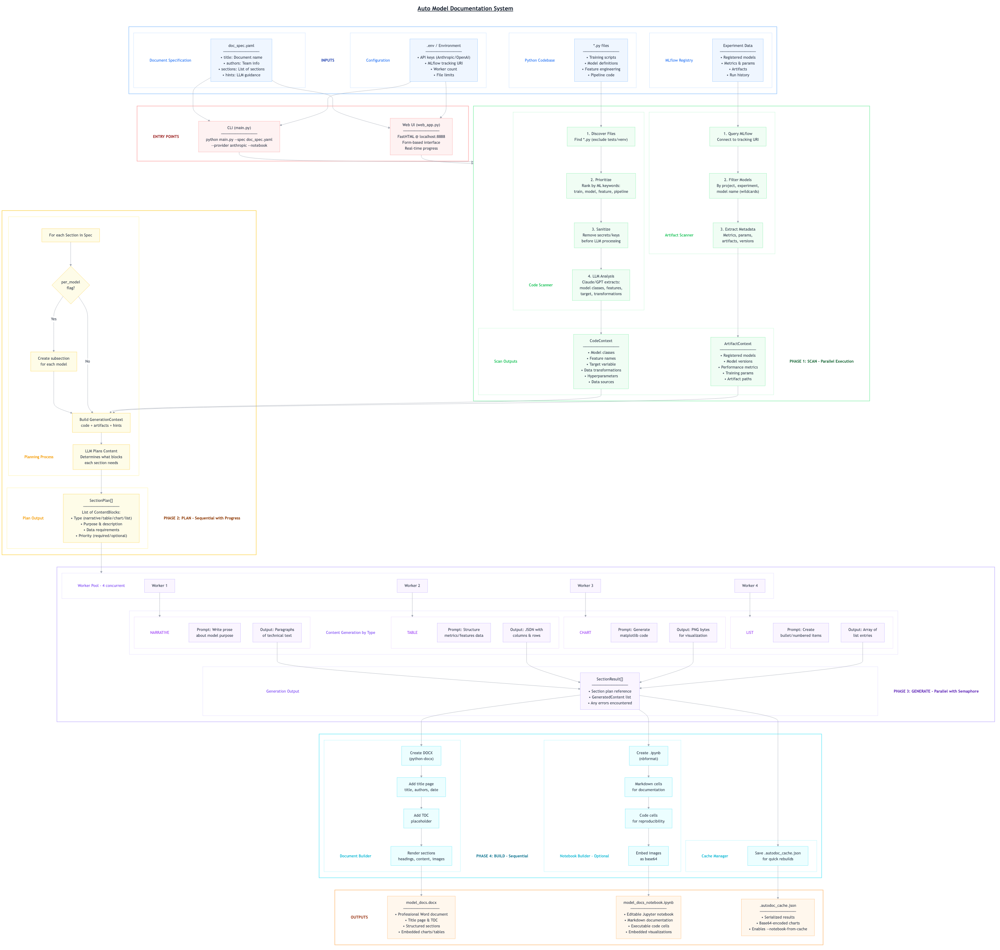

# **Auto Model Documentation**

Automatically generate professional ML model documentation from code and MLflow artifacts.

## **Table of Contents**

1. [Overview](#1-overview)
2. [Getting Started](#2-getting-started)
3. [Web UI Guide](#3-web-ui-guide)
   * 3.1 [Accessing the Web Interface](#31-accessing-the-web-interface)
   * 3.2 [Configuration Panel](#32-configuration-panel)
   * 3.3 [Options Panel](#33-options-panel)
   * 3.4 [Advanced Options](#34-advanced-options)
   * 3.5 [Artifact Filtering](#35-artifact-filtering)
   * 3.6 [Running a Job](#36-running-a-job)
4. [CLI Usage](#4-cli-usage)
   * 4.1 [Basic Command Structure](#41-basic-command-structure)
   * 4.2 [Key Arguments](#42-key-arguments)
   * 4.3 [Filtering Options](#43-filtering-options)
   * 4.4 [Advanced Options](#44-advanced-options)
   * 4.5 [Example Commands](#45-example-commands)
5. [Document Specification (YAML)](#5-document-specification-yaml)
   * 5.1 [Spec File Structure](#51-spec-file-structure)
   * 5.2 [Section Configuration](#52-section-configuration)
   * 5.3 [Per-Model Sections](#53-per-model-sections)
   * 5.4 [Hints for Guiding Content](#54-hints-for-guiding-content)
   * 5.5 [Example Spec File](#55-example-spec-file)
6. [Pipeline Phases](#6-pipeline-phases)
   * 6.1 [Scanning Phase](#61-scanning-phase)
   * 6.2 [Planning Phase](#62-planning-phase)
   * 6.3 [Generation Phase](#63-generation-phase)
   * 6.4 [Building Phase](#64-building-phase)
7. [Output Formats](#7-output-formats)
   * 7.1 [Word Document (.docx)](#71-word-document-docx)
   * 7.2 [Jupyter Notebook (.ipynb)](#72-jupyter-notebook-ipynb)
   * 7.3 [Cache File](#73-cache-file)
8. [Configuration Reference](#8-configuration-reference)
   * 8.1 [Environment Variables](#81-environment-variables)
   * 8.2 [LLM Provider Settings](#82-llm-provider-settings)
   * 8.3 [MLflow Settings](#83-mlflow-settings)
   * 8.4 [Parallelization Settings](#84-parallelization-settings)
9. [Best Practices](#9-best-practices)

---

## **1. Overview** {#1-overview}

Auto Model Documentation is an LLM-powered tool that automatically generates professional documentation for machine learning models. It analyzes your ML codebase, extracts information from MLflow artifacts, and produces comprehensive Word documents and Jupyter notebooks describing your models, features, training pipelines, and performance metrics.


### **Key Capabilities**

| Feature | Description |
| ------- | ----------- |
| **Code Analysis** | Scans Python source files to understand model architecture, feature engineering, and training logic |
| **MLflow Integration** | Extracts metrics, parameters, and artifacts from registered models and experiments |
| **LLM-Powered Generation** | Uses Claude or GPT-4 to create natural language documentation from technical artifacts |
| **Word Document Output** | Generates professional .docx files with tables, charts, and formatted sections |
| **Jupyter Notebook Output** | Creates editable notebooks for further customization and sharing |
| **Caching** | Saves generation results for fast notebook regeneration |

### **Two Access Methods**

Auto Model Documentation provides two ways to generate documentation:

* **Web UI**: A browser-based interface for interactive configuration and job monitoring
* **CLI**: A command-line tool for scripting and automation

---

## **2. Getting Started** {#2-getting-started}

### **Prerequisites**

Before using Auto Model Documentation, ensure you have:

* Python 3.10 or higher installed
* Access to an LLM API (Anthropic Claude or OpenAI GPT-4)
* MLflow tracking server access (if documenting registered models)
* Your ML codebase accessible from the local filesystem

### **Installation**

Install the package and its dependencies:

```bash
# Clone or download the repository
cd auto_model_docs

# Install in development mode
pip install -e .

# Or install dependencies directly
pip install -r requirements.txt
```

The package requires the following core dependencies:

| Package | Purpose |
| ------- | ------- |
| `anthropic` | Anthropic Claude API client |
| `openai` | OpenAI GPT API client |
| `mlflow` | MLflow tracking and model registry access |
| `python-docx` | Word document generation |
| `matplotlib` | Chart and visualization generation |
| `pyyaml` | YAML spec file parsing |
| `rich` | Terminal progress display |

### **Environment Setup**

Set up your API keys and MLflow configuration. Create a `.env` file in the project root or set environment variables:

```bash
# LLM API Keys (set one or both)
ANTHROPIC_API_KEY=your-anthropic-api-key
OPENAI_API_KEY=your-openai-api-key

# Optional: Custom OpenAI-compatible endpoint
OPENAI_BASE_URL=https://api.example.com/v1

# MLflow Configuration (optional)
MLFLOW_TRACKING_URI=https://your-mlflow-server.com
```

**Tip:** In Domino environments, the MLflow tracking URI is automatically configured. You can also pass API keys directly via the CLI or Web UI.

---

## **3. Web UI Guide** {#3-web-ui-guide}

The Web UI provides an intuitive interface for configuring and running documentation generation jobs.

### **3.1 Accessing the Web Interface** {#31-accessing-the-web-interface}

Start the web application:

```bash
python web_app.py
```

The application launches on `http://localhost:8000` by default. In Domino, the app is accessible through the workspace URL.

### **3.2 Configuration Panel** {#32-configuration-panel}

The configuration panel contains the essential settings for document generation.


| Field | Description |
| ----- | ----------- |
| **Spec File** | Path to the YAML document specification file. Defaults to `doc_spec.yaml` in the project root. |
| **Upload Spec** | Alternatively, upload a spec file directly from your computer. |
| **Code Root** | Root directory of the ML codebase to analyze. Defaults to `/mnt/code` in Domino or `.` locally. |
| **Output Directory** | Where to save generated documents. Defaults to `/mnt/data/{project_name}` in Domino or `./output` locally. |

### **3.3 Options Panel** {#33-options-panel}

Configure the LLM provider and model settings.

| Field | Description |
| ----- | ----------- |
| **Provider** | Select `anthropic` (Claude) or `openai` (GPT-4). Default: `openai` |
| **API Key** | Your API key for the selected provider. Can also be set via environment variable. |
| **Model** | Model name override. If blank, uses `claude-sonnet-4-20250514` for Anthropic or `gpt-4o` for OpenAI. |
| **Base URL** | Custom API endpoint for OpenAI-compatible services (e.g., Azure OpenAI, local models). |

### **3.4 Advanced Options** {#34-advanced-options}

Fine-tune the generation process with advanced settings.

| Field | Description | Default |
| ----- | ----------- | ------- |
| **Generation Workers** | Number of parallel workers for content generation. Higher values speed up generation but increase API costs. | 4 |
| **Planning Workers** | Number of parallel workers for section planning. | 4 |
| **Max Files** | Maximum number of source files to scan from the codebase. | 50 |
| **Timeout** | Timeout for individual LLM API calls in seconds. | 120 |
| **Generate Notebook** | Also create an editable Jupyter notebook alongside the Word document. | Off |
| **Notebook Path** | Custom path for the generated notebook. | `<output>/model_docs_notebook.ipynb` |
| **Verbose** | Enable detailed logging to show progress of each pipeline step. | Off |

### **3.5 Artifact Filtering** {#35-artifact-filtering}

Control which MLflow models and experiments are included in the documentation.

| Field | Description |
| ----- | ----------- |
| **Model Names** | Comma-separated list of model names to include. Supports wildcards: `*` (any characters) and `?` (single character). Example: `churn*,fraud_detector` |
| **Experiment Names** | Comma-separated list of experiment names to include. Supports wildcards. Example: `customer_churn*,fraud_detection` |
| **Latest Only** | When checked, only includes the latest version of each model, ignoring older versions. |

**Tip:** Use wildcards to match multiple models. For example, `prod_*` matches all models starting with "prod_".

### **3.6 Running a Job** {#36-running-a-job}

1. Configure your settings in the form panels
2. Click **Generate Documentation** to start the job
3. Monitor progress in the **Logs** panel


The progress display shows four phases:

* **Scanning**: Analyzing code and extracting MLflow artifacts
* **Planning**: LLM planning content blocks for each section
* **Generating**: Creating narratives, tables, and charts
* **Building**: Assembling the final Word document

Once complete, download links appear for the generated files:


**Tip:** Click **Stop** to cancel a running job. The application will clean up any partial artifacts.

---

## **4. CLI Usage** {#4-cli-usage}

The command-line interface provides full control over documentation generation for automation and scripting.

### **4.1 Basic Command Structure** {#41-basic-command-structure}

```bash
python main.py --spec <path-to-spec.yaml> [options]
```

The `--spec` argument is required and specifies the YAML document specification file.

### **4.2 Key Arguments** {#42-key-arguments}

| Argument | Short | Description |
| -------- | ----- | ----------- |
| `--spec` | `-s` | **Required.** Path to YAML document specification file. |
| `--output` | `-o` | Output directory for generated documents. |
| `--code-root` | `-c` | Root directory of codebase to analyze. |
| `--provider` | `-p` | LLM provider: `anthropic` or `openai`. Default: `openai` |
| `--model` | `-m` | Model name override (uses provider default if not set). |
| `--verbose` | `-v` | Enable verbose output with detailed progress. |
| `--notebook` | | Also generate an editable Jupyter notebook. |
| `--notebook-path` | | Custom path for the generated notebook. |
| `--notebook-from-cache` | | Regenerate notebook from cached results (skips full pipeline). |

### **4.3 Filtering Options** {#43-filtering-options}

Filter which MLflow models and experiments are documented:

| Argument | Description |
| -------- | ----------- |
| `--experiments` | Comma-separated list of experiment names/patterns. Supports wildcards. |
| `--models` | Comma-separated list of model names/patterns. Supports wildcards. |
| `--latest-only` | Only include the latest version of each model. |
| `--disable-project-filtering` | Disable automatic Domino project filtering (scan all projects). |

### **4.4 Advanced Options** {#44-advanced-options}

| Argument | Description | Default |
| -------- | ----------- | ------- |
| `--generation-workers`, `-w` | Number of parallel content generation workers. | 4 |
| `--planning-workers` | Number of parallel section planning workers. | 4 |
| `--max-files` | Maximum number of source files to scan. | 50 |
| `--timeout` | Timeout for individual LLM API calls (seconds). | 120 |
| `--max-retries` | Maximum retries for failed LLM requests. | 3 |
| `--initial-backoff` | Initial backoff delay for retries (seconds). | 3.0 |
| `--max-backoff` | Maximum backoff delay (seconds). | 30.0 |
| `--backoff-jitter` | Random jitter factor for backoff (0.0-1.0). | 0.2 |

### **4.5 Example Commands** {#45-example-commands}

**Basic generation with Anthropic Claude:**

```bash
python main.py --spec doc_spec.yaml --provider anthropic
```

**Generate with verbose output and notebook:**

```bash
python main.py --spec doc_spec.yaml \
    --provider openai \
    --notebook \
    --verbose
```

**Filter to specific models and experiments:**

```bash
python main.py --spec doc_spec.yaml \
    --provider anthropic \
    --models "churn_model*,fraud_detector" \
    --experiments "production_*" \
    --latest-only
```

**Custom paths and parallel workers:**

```bash
python main.py --spec custom_spec.yaml \
    --code-root /path/to/ml/project \
    --output /path/to/output \
    --generation-workers 8 \
    --planning-workers 4 \
    --max-files 100
```

**Regenerate notebook from cached results:**

```bash
python main.py --spec doc_spec.yaml \
    --notebook-from-cache \
    --notebook-path ./updated_notebook.ipynb
```

---

## **5. Document Specification (YAML)** {#5-document-specification-yaml}

The document specification file defines the structure and content of the generated documentation.

### **5.1 Spec File Structure** {#51-spec-file-structure}

A spec file contains three main components:

```yaml
# Document metadata
title: "Machine Learning Model Documentation"
authors: "Data Science Team"

# Sections to include
sections:
  - Executive Summary
  - Data Overview
  - Model Architecture
  - Model Performance
  - Conclusion

# Optional hints for content guidance
hints:
  "Executive Summary": >
    Focus on business impact and key metrics.
```

### **5.2 Section Configuration** {#52-section-configuration}

The `sections` list defines which sections appear in the document and their order:

```yaml
sections:
  - Executive Summary
  - Data Overview
  - Feature Engineering
  - Model Architecture
  - Training Pipeline
  - Model Performance
  - Validation Results
  - Deployment Considerations
  - Conclusion
  - Appendix
```

Each section name becomes a heading in the generated document. The LLM generates appropriate content based on the section name and any hints provided.

### **5.3 Per-Model Sections** {#53-per-model-sections}

For multi-model documentation, use the `per_model` modifier to create separate subsections for each registered model:

```yaml
sections:
  - Executive Summary
  - Data Overview
  - "Model Performance: per_model"  # Creates subsection for each model
  - Conclusion
```

This generates sections like:

* 5. Model Performance
  * 5.1 Model Performance: churn_predictor
  * 5.2 Model Performance: fraud_detector

### **5.4 Hints for Guiding Content** {#54-hints-for-guiding-content}

Use hints to guide the LLM on what content to emphasize for each section:

```yaml
hints:
  "Executive Summary": >
    Focus on business impact, key metrics, and high-level model capabilities.
    Keep it suitable for non-technical stakeholders.

  "Data Overview": >
    Describe data sources, volume, quality considerations, and any data
    preprocessing steps applied before feature engineering.

  "Model Performance": >
    Present key metrics (accuracy, AUC, F1, etc.), confusion matrix
    insights, and performance analysis across different segments.

  "Validation Results": >
    Document the validation approach based on what is found in the code.
    Do not describe validation methods that were not actually implemented.

  "Conclusion": >
    Summarize key model capabilities and performance highlights.
    Do not introduce new technical details - synthesize what was covered.
```

**Tip:** Be specific in hints about what to include or exclude. The LLM will follow these guidelines when generating content.

### **5.5 Example Spec File** {#55-example-spec-file}

Complete example specification:

```yaml
# Document Specification for Auto Model Documentation
title: "Machine Learning Model Documentation"
authors: "Data Science Team"

sections:
  - Executive Summary
  - Data Overview
  - Feature Engineering
  - Model Architecture
  - Training Pipeline
  - "Model Performance: per_model"
  - Validation Results
  - Deployment Considerations
  - Conclusion
  - Appendix

hints:
  "Executive Summary": >
    Focus on business impact, key metrics, and high-level model capabilities.
    Keep it suitable for non-technical stakeholders.

  "Data Overview": >
    Describe data sources, volume, quality considerations, and any data
    preprocessing steps applied before feature engineering.

  "Feature Engineering": >
    Document feature transformations, encoding methods, scaling approaches,
    and feature selection rationale.

  "Model Architecture": >
    Include model type, hyperparameters, training configuration,
    and architectural decisions.

  "Model Performance": >
    Present key metrics (accuracy, AUC, F1, etc.), confusion matrix
    insights, and performance analysis across different segments.

  "Validation Results": >
    Document the validation approach used based on what is found in the code.
    If cross-validation was implemented, cover those results.
    If only holdout/test set validation was used, document that approach.

  "Deployment Considerations": >
    Address inference latency, resource requirements, monitoring strategy,
    and model refresh cadence.

  "Conclusion": >
    Summarize the key model capabilities and performance highlights.
    Describe recommended monitoring approach based on the model type.
```

---

## **6. Pipeline Phases** {#6-pipeline-phases}

Auto Model Documentation executes a 4-phase pipeline to generate documentation.



### **6.1 Scanning Phase** {#61-scanning-phase}

The scanning phase extracts information from two sources in parallel:

**Code Scanner:**
* Scans Python files in the code root directory
* Extracts function definitions, class structures, and docstrings
* Identifies ML-related patterns (model training, feature engineering)
* Respects `max_files` limit to control scope

**Artifact Scanner:**
* Connects to MLflow tracking server
* Queries registered models and experiment runs
* Extracts metrics, parameters, tags, and artifact metadata
* Applies model/experiment filters if specified

### **6.2 Planning Phase** {#62-planning-phase}

The planning phase uses the LLM to create a content plan for each section:

* Analyzes the scanned context (code + artifacts)
* Determines what content blocks are needed for each section
* Plans narratives, tables, charts, and other elements
* Considers hints from the spec file
* Runs in parallel with configurable worker count

### **6.3 Generation Phase** {#63-generation-phase}

The generation phase creates actual content for each planned block:

* **Narratives**: Natural language descriptions and explanations
* **Tables**: Structured data like metrics, parameters, feature lists
* **Charts**: Visualizations of metrics, performance trends, distributions
* Processes blocks in parallel for efficiency

### **6.4 Building Phase** {#64-building-phase}

The building phase assembles the final outputs:

* Creates Word document with proper formatting and styles
* Inserts tables, charts, and images
* Generates Jupyter notebook if requested
* Saves cache file for future notebook regeneration

---

## **7. Output Formats** {#7-output-formats}

### **7.1 Word Document (.docx)** {#71-word-document-docx}

The primary output is a professionally formatted Word document:

| Feature | Description |
| ------- | ----------- |
| **Structured Sections** | Hierarchical headings matching the spec file structure |
| **Formatted Tables** | Metrics, parameters, and data presented in clean tables |
| **Embedded Charts** | Matplotlib visualizations inserted as images |
| **Consistent Styling** | Professional typography and layout |
| **Editable** | Open in Microsoft Word or Google Docs for further editing |

Default location: `<output_dir>/model_documentation.docx`

### **7.2 Jupyter Notebook (.ipynb)** {#72-jupyter-notebook-ipynb}

When `--notebook` is enabled, generates an editable notebook:

| Feature | Description |
| ------- | ----------- |
| **Markdown Cells** | Section content as editable markdown |
| **Code Cells** | Executable code for reproducing charts and tables |
| **Interactive** | Run and modify in Jupyter Lab or VS Code |
| **Shareable** | Export to HTML, PDF, or other formats |

Default location: `<output_dir>/model_docs_notebook.ipynb`

### **7.3 Cache File** {#73-cache-file}

A JSON cache file stores generation results:

| Feature | Description |
| ------- | ----------- |
| **Fast Regeneration** | Rebuild notebook without re-running the full pipeline |
| **Preserves Content** | All generated text, tables, and chart data |
| **Use with `--notebook-from-cache`** | Skip scanning, planning, and generation phases |

Location: `<output_dir>/.autodoc_cache.json`

---

## **8. Configuration Reference** {#8-configuration-reference}

### **8.1 Environment Variables** {#81-environment-variables}

All settings can be configured via environment variables with or without the `AUTODOC_` prefix:

| Variable | Description | Default |
| -------- | ----------- | ------- |
| `ANTHROPIC_API_KEY` | Anthropic Claude API key | - |
| `OPENAI_API_KEY` | OpenAI GPT API key | - |
| `OPENAI_BASE_URL` | Custom OpenAI-compatible endpoint | - |
| `MLFLOW_TRACKING_URI` | MLflow tracking server URI | - |
| `CODE_ROOT` | Root directory of codebase | `/mnt/code` |
| `OUTPUT_DIR` | Output directory | `/mnt/data/{project}` or `./output` |
| `MAX_FILES` | Maximum files to scan | 50 |
| `PARALLEL_WORKERS` | Content generation workers | 1 |
| `PLANNING_WORKERS` | Section planning workers | 1 |

### **8.2 LLM Provider Settings** {#82-llm-provider-settings}

| Variable | Description | Default |
| -------- | ----------- | ------- |
| `LLM_PROVIDER` | Provider: `anthropic` or `openai` | `anthropic` |
| `LLM_MODEL` | Model name override | Provider default |
| `LLM_MAX_RETRIES` | Max retries for requests | 3 |
| `LLM_INITIAL_BACKOFF` | Initial retry backoff (seconds) | 3.0 |
| `LLM_MAX_BACKOFF` | Maximum retry backoff (seconds) | 30.0 |
| `LLM_BACKOFF_JITTER` | Jitter factor (0.0-1.0) | 0.2 |

**Default models by provider:**

| Provider | Default Model |
| -------- | ------------- |
| Anthropic | `claude-sonnet-4-20250514` |
| OpenAI | `gpt-4o` |

### **8.3 MLflow Settings** {#83-mlflow-settings}

| Variable | Description |
| -------- | ----------- |
| `MLFLOW_TRACKING_URI` | MLflow tracking server URL |
| `MLFLOW_EXPERIMENT_NAME` | Default experiment to query |

In Domino environments, MLflow is automatically configured. Use filtering options to control which models are documented.

### **8.4 Parallelization Settings** {#84-parallelization-settings}

Control parallel execution to balance speed and API costs:

| Setting | Recommended Value | Notes |
| ------- | ----------------- | ----- |
| **Generation Workers** | 4-8 | Higher values speed up generation |
| **Planning Workers** | 4 | Planning is typically faster than generation |
| **Max Files** | 50-100 | Increase for larger codebases |

**Tip:** Start with lower worker counts and increase if you have API rate limit headroom.

---

## **9. Best Practices** {#9-best-practices}

### **Tips for Better Documentation**

1. **Write descriptive docstrings** in your ML code. The scanner extracts these for context.

2. **Use meaningful MLflow experiment and model names.** These appear in the generated documentation.

3. **Log comprehensive metrics** to MLflow. The more metrics available, the richer the documentation.

4. **Organize code logically.** Separate feature engineering, model training, and evaluation into distinct modules.

5. **Use clear function and variable names.** The LLM uses these to understand code intent.

### **Recommended YAML Spec Patterns**

1. **Start broad, then specific:**
   ```yaml
   sections:
     - Executive Summary      # High-level overview
     - Technical Deep Dive    # Detailed technical content
     - Appendix              # Supporting details
   ```

2. **Use per_model for multi-model projects:**
   ```yaml
   sections:
     - "Model Performance: per_model"
     - "Deployment Guide: per_model"
   ```

3. **Provide detailed hints for critical sections:**
   ```yaml
   hints:
     "Executive Summary": >
       This section is for executive stakeholders.
       Focus on business value and ROI.
       Avoid technical jargon.
   ```

### **Performance Optimization**

1. **Limit file scanning** for large codebases:
   ```bash
   --max-files 30
   ```

2. **Use model filtering** to focus on specific models:
   ```bash
   --models "production_*" --latest-only
   ```

3. **Increase workers** if you have API rate limit headroom:
   ```bash
   --generation-workers 8 --planning-workers 4
   ```

4. **Use notebook caching** for iterative refinement:
   ```bash
   # First run: full generation
   python main.py --spec doc_spec.yaml --notebook

   # Subsequent runs: fast notebook rebuild
   python main.py --spec doc_spec.yaml --notebook-from-cache
   ```

5. **Enable verbose mode** for debugging:
   ```bash
   python main.py --spec doc_spec.yaml --verbose
   ```

---

For additional help or to report issues, refer to the project repository or contact the Data Science Team.
