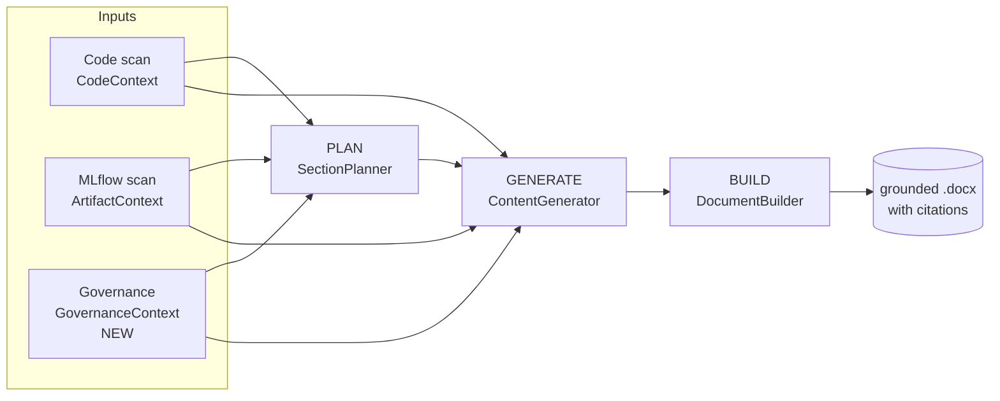
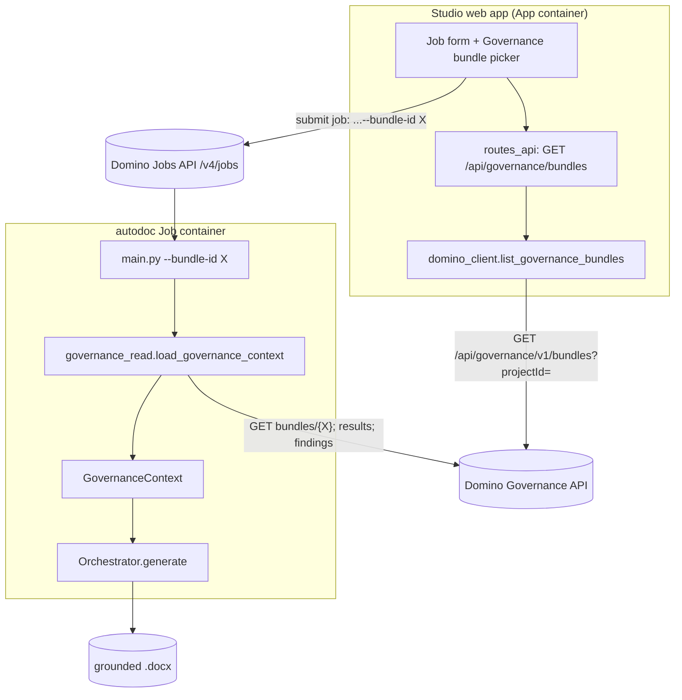
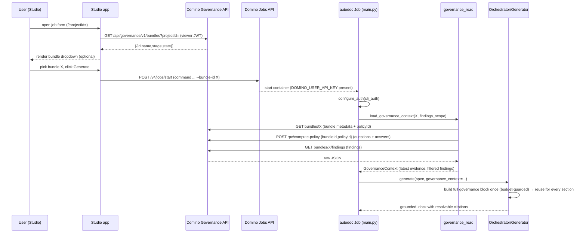
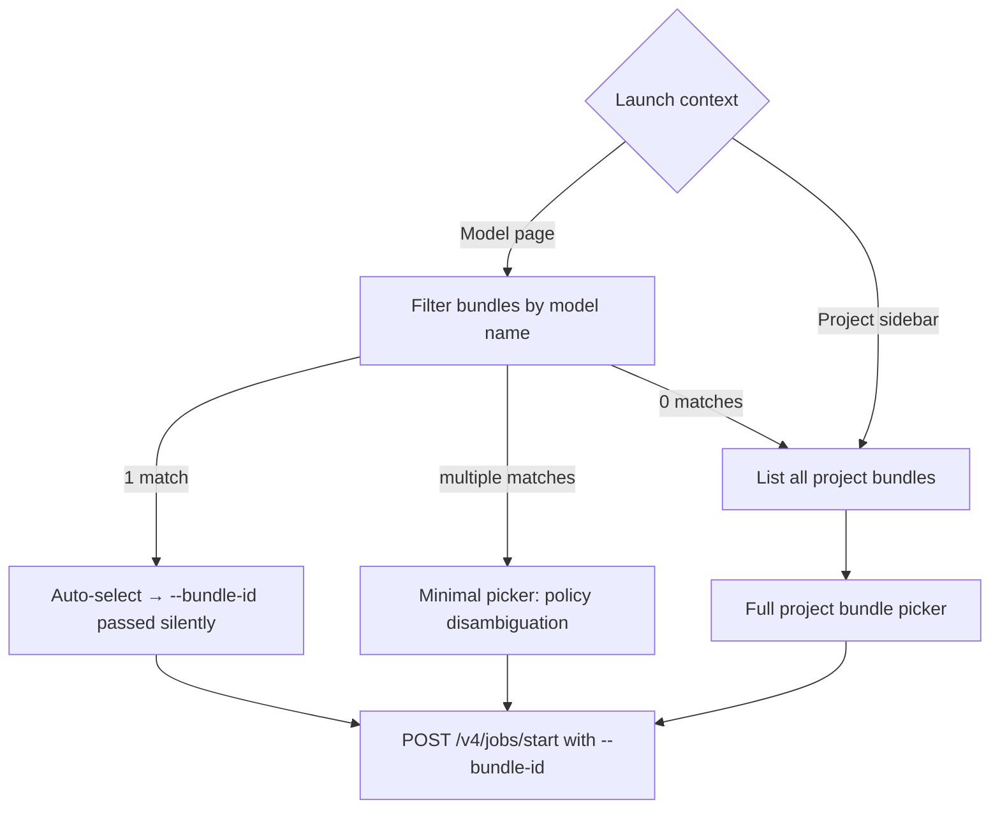

# Governance Context for Auto Model Documentation — Developer Handover

**Target repo:** `dominodatalab/AutoDocumentation_Extension` @ branch `ddl-bira-ignacio.governance`
**Status:** Design handover. Self-contained — a developer can design and build from this without further questions, except the bounded open items in [§11 Open items](#11-open-items--confirm-before-coding).
**Diagrams:** Mermaid (render in GitHub/VS Code preview).

---

## Table of contents

1. [Context &amp; problem](#1-context--problem)
2. [What &#34;Domino Governance context&#34; means here](#2-what-domino-governance-context-means-here)
3. [Scope](#3-scope)
4. [How the existing pipeline works (background)](#4-how-the-existing-pipeline-works-background)
5. [Solution architecture](#5-solution-architecture)
6. [Data contracts](#6-data-contracts)
7. [Prompt engineering spec (literal)](#7-prompt-engineering-spec-literal)
8. [Implementation guide (file-by-file)](#8-implementation-guide-file-by-file)
9. [Studio UI: bundle picker](#9-studio-ui-bundle-picker)
10. [Test plan](#10-test-plan)
11. [Open items — confirm before coding](#11-open-items--confirm-before-coding)

---

## 1. Context & problem

AutoDocumentation generates model documentation by scanning a project's **code** and **MLflow artifacts** and having an LLM write narrative sections, grounded in citable "evidence" facts (`[@code.*]`, `[@mlflow.*]`).

**The gap:** the tool has **no awareness of the Domino Governance bundle** the model is being documented for. Risk tier, intended use, validation status, approval state, and any raised issues are therefore *inferred* by the LLM instead of grounded in the governing record.

**This feature** feeds real governance context into generation so the narrative is grounded in — and cites — the bundle's actual record:

- **Bundle** identity + policy + current stage/state.
- **Evidence** (the answered policy questions — latest answer per question).
- **Findings** (issues raised against the bundle).

These become **citable facts woven into the relevant sections** (`[@evidence.*]`, `[@finding.*]`, `[@governance.*]`) — exactly how code/MLflow facts already work. No new doc sections. The LLM is instructed to treat governance facts as verbatim ground truth.

---

## 2. What "Domino Governance context" means here

Domino Governance manages the model-risk lifecycle. Entities the developer must know:

| Entity                       | Meaning                                                                                                                                                                               | API base                                                              |
| ---------------------------- | ------------------------------------------------------------------------------------------------------------------------------------------------------------------------------------- | --------------------------------------------------------------------- |
| **Governed Bundle**    | A package tying a project/model to a governance**policy** that moves through lifecycle **stages** (Draft → Review → Approved…). Holds evidence, findings, attachments. | `/api/governance/v1/bundles`                                        |
| **Policy**             | Defines the stages and, per stage, an `evidenceSet` of required **questions** (artifacts).                                                                                    | `/api/governance/v1/policies/{id}/definition`                       |
| **Evidence / Results** | Stakeholders' **answers** to policy questions. Questions live in the policy definition; answers submitted against them. `isLatest` flag identifies the current answer per question. | `POST /api/governance/v1/rpc/compute-policy` (body `{bundleId, policyId}`) |
| **Findings**           | Issues/observations raised against a bundle, with severity + status (`"To do"` = open). Can be resolved or dismissed.                                                                | `GET /api/governance/v1/bundles/{id}/findings`                          |
| **Attachments**        | Files attached to the bundle (e.g. the generated `.docx`). Out of scope here.                                                                                                       | `/api/governance/v1/bundles/{id}/attachments`                       |

Note : Governance API base path is `/api/governance/v1/` (NOT `/v4/`).

## 3. Scope

**In scope**

- An **optional** `--bundle-id` CLI flag on the autodoc Job. When present, the Job fetches bundle + latest evidence + findings and threads them as citable facts. When absent, the Job runs exactly as today — no governance context, no behavioral change. The flag is optional by design: the extension that launches the Job typically supplies it automatically; it is omitted when no bundle is applicable or when the caller cannot determine which bundle to use.
- A new typed `GovernanceContext` model.
- A governance read client (Job-side) + a Studio list endpoint (app-side) for a bundle picker.
- Prompt + citation wiring so governance facts render with resolvable citations.
- Spec-driven findings filter (the doc spec decides scope; default = open/unresolved only).

**Out of scope**

- Writing the generated doc back to the bundle as an attachment.
- Auto-creating findings from generation gaps.
- Full evidence revision history (we keep latest-only by design).
- Dedicated "Evidence" / "Findings" doc sections (surfacing is citation-woven only).

**Decisions already made:** Job fetches directly (no external Portal, no context file); citable-facts-woven-in; findings scope is spec-driven; `--bundle-id` is optional (not required) — the extension drives selection in normal flow, with user override available when multiple policies compete.

---

## 4. How the existing pipeline works

The orchestrator runs a 4-phase pipeline — SCAN → PLAN → GENERATE → BUILD. Governance context enters as a **third context source** alongside code and MLflow (the diagram's *Inputs* are the SCAN-phase outputs), and rides the existing citation machinery.



Key existing seams (canonical repo, `auto_model_docs/`):

- `autodoc/core/models.py` — `GenerationContext` is the per-section bundle of context handed to generators. `Citation`. `CodeContext`/`ArtifactContext`/`CodeEvidence` dataclasses. `DocumentSpec`/`SectionSpec`.
- `autodoc/generation/generator.py` — `ContentGenerator` formats evidence into prompt blocks: `_format_code_evidence(context.code_context)` and `_format_mlflow_evidence(context)`, passes them as `code_evidence=`/`mlflow_evidence=` to `build_*_prompt(...)`, then resolves `[@id]` markers via `_collect_citations_for_text/table/chart`.
- `autodoc/llm/prompts.py` — `build_narrative_prompt`, `build_table_prompt`, `build_chart_prompt`, `build_list_prompt`. Each already accepts `code_evidence`/`mlflow_evidence` string params and splices them under "Additional Context".
- `autodoc/generation/citations.py` — `build_code_citation_id`, `build_mlflow_citation_id`, `parse_citation_id`, `extract_citation_ids`. This is the citation registry the new governance IDs plug into.
- `autodoc/orchestrator.py` — `Orchestrator.__init__` + `generate(spec, on_progress, on_status)` (no bundle context today).
- `auto_model_docs/main.py` — Click CLI entry (no `--bundle-id` today).
- `auto_model_docs/domino_client.py` — `_domino_request(method, path, *, json, params)` httpx helper with retry; `resolve_project`, `get_project_context`, `browse_code`, `submit_job(...)`, `build_job_url`.
- `auto_model_docs/domino_auth.py` — `configure_auth(provider)`, `current_auth().to_headers()`, providers `user_auth()` (JWT, Studio) and `cli_auth()` (API key, Job), `resolve_api_host()` = `DOMINO_API_PROXY` > `DOMINO_API_HOST`.
- `auto_model_docs/studio/job_engine.py` — `_parse_request` → `JobRequest`, `_build_job_command` builds the CLI arg list, `_submit_domino_job`.

The design mirrors the **code/MLflow evidence path end-to-end**, so governance facts inherit citation rendering and the anti-fabrication discipline for free. The full governance block is passed to every section (see §7.4 — no per-section filtering in v1).

---

## 5. Solution architecture

### 5.1 System context



### 5.2 End-to-end sequence



### 5.3 Component responsibilities

| Component                                                                                            | New/changed   | Responsibility                                                                                                                                                          |
| ---------------------------------------------------------------------------------------------------- | ------------- | ----------------------------------------------------------------------------------------------------------------------------------------------------------------------- |
| `autodoc/governance_read.py`                                                                       | **NEW** | Job-side reads via `_domino_request`; bundle/evidence/findings → `GovernanceContext`; latest-answer dedup; findings filter; never hard-fails.                      |
| `autodoc/core/models.py`                                                                           | changed       | `EvidenceItem`, `Finding`, `GovernanceContext` dataclasses; `GenerationContext.governance_context`; `DocumentSpec.governance_findings_scope`.                 |
| `autodoc/generation/citations.py`                                                                  | changed       | `build_evidence_citation_id`, `build_finding_citation_id`, `build_governance_citation_id`; teach `parse_citation_id`/`extract_citation_ids` the new prefixes. |
| `autodoc/llm/prompts.py`                                                                           | changed       | `governance_evidence` param on the 4 `build_*_prompt`s; governance anti-fabrication clause; system-prompt note.                                                     |
| `autodoc/generation/generator.py`                                                                  | changed       | `_format_governance_evidence(context)`; pass `governance_evidence=`; resolve governance citations.                                                                  |
| `autodoc/orchestrator.py`                                                                          | changed       | accept + thread the full `governance_context` into every section (no per-section filter); apply the token-budget guard once (§7.4).                                  |
| `auto_model_docs/main.py`                                                                          | changed       | `--bundle-id`, `--findings-scope`; configure cli_auth; load context; pass to Orchestrator.                                                                          |
| `auto_model_docs/domino_client.py`                                                                 | changed       | `list_governance_bundles(project_id)` for the picker.                                                                                                                 |
| `studio/routes_api.py`, `studio/state.py`, `studio/job_engine.py`, `studio/ui_components.py` | changed       | bundle list route;`JobRequest.bundle_id`; `--bundle-id` in command; dropdown UI.                                                                                    |

---

## 6. Data contracts

### 6.1 Governance API reads (Job-side)

All under `{DOMINO_API_HOST}/api/governance/v1/`, via `domino_client._domino_request("GET", path, params=...)` after `configure_auth(cli_auth)`. **Parse defensively** (multi-key fallback) — the repo convention assumes response shapes vary by deployment. Paths and field names below are confirmed from real API payloads; the few remaining open items are in §11.

**(a) Bundle** — `GET /api/governance/v1/bundles/{bundle_id}` *(confirm direct GET exists; §11)*

```jsonc
{
  "id": "a1b2c3d4-...",
  "name": "Churn Model Bundle",
  "projectId": "proj-123",
  "projectOwner": "alice.chen",             // maps to GovernanceContext.owner
  "policyId": "f0e1d2c3-...",               // required — pass to compute-policy for evidence
  "policyName": "Credit Risk Model Policy",
  "stage": "Stage 1",
  "state": "Active",                         // "Active" | "Archived" | "Complete"
  "classificationValue": "High",             // risk tier — NOT "riskTier"
  "attachments": [
    {
      "type": "ModelVersion",
      "identifier": { "name": "churn-model", "version": 3 }  // model name + version link
    }
  ],
  "currentStageInfo": {
    "status": "InProgress",
    "openFindingsCount": 2
  }
}
```

**(b) Evidence / results** — `POST /api/governance/v1/rpc/compute-policy`

Request body: `{"bundleId": "<id>", "policyId": "<policyId from bundle §6.1a>"}`.

The response combines the full policy definition (questions) with the submitted answers (results) — questions and answers must be joined client-side.

```jsonc
// Relevant subset of the response
{
  "policy": {
    "stages": [
      {
        "name": "Stage 1",
        "evidenceSet": [
          {
            "id": "ev-uuid-1",             // evidenceSet UUID
            "name": "Model Training Documentation",
            "artifacts": [
              {
                "id": "art-uuid-1",        // artifact UUID — the question identifier
                "artifactType": "input",   // only "input" artifacts carry question text
                "details": {
                  "text": "Was the model validated on a hold-out dataset?",
                  "type": "Radio",
                  "options": ["Yes", "No", "Partially"]
                }
              }
            ]
          }
        ]
      }
    ]
  },
  "results": [
    {
      "evidenceId": "ev-uuid-1",           // matches evidenceSet.id
      "artifactId": "art-uuid-1",          // matches artifact.id
      "artifactContent": { "value": "Yes" },  // answer — always use content["value"]
      "isLatest": true,                    // filter on this — API flags the latest result
      "createdAt": "2026-02-10T14:00:00Z"
    }
  ]
}
```

**Question–answer join (in `governance_read.py`):**
1. Walk `policy.stages[*].evidenceSet[*].artifacts[*]` — keep only `artifactType == "input"` entries (these carry `details.text`).
2. For each artifact, find results where `str(result.evidenceId) == str(evidenceSet.id) AND str(result.artifactId) == str(artifact.id) AND result.isLatest == True`.
3. Question = `artifact.details["text"]`. Answer = `result.artifactContent.get("value", str(result.artifactContent))`.

**Latest-per-question rule:** use `isLatest == True` — the API already flags the latest result per artifact. No manual `updatedAt`/`version` dedup required.

**(c) Findings** — `GET /api/governance/v1/bundles/{bundle_id}/findings`

```jsonc
{
  "data": [
    {
      "id": "find-uuid-1",
      "name": "Validation methodology not documented",   // finding title — field is "name", not "title"
      "description": "The model validation process lacks documentation of the hold-out dataset characteristics.",
      "severity": "S2",
      "status": "To do",                     // "To do" = open/actionable (confirm full vocabulary — §11)
      "artifactLabel": "Was the model validated on a hold-out dataset?",  // question it's attached to
      "evidenceId": "ev-uuid-1",             // links to evidenceSet
      "artifactId": "art-uuid-1",            // links to specific question
      "dueDate": "2026-07-01T00:00:00Z",
      "assignee": { "id": "usr-2", "name": "Bob Smith" }
    }
  ],
  "meta": { "pagination": { "offset": 0, "limit": 25, "totalCount": 1 } }
}
```

**(d) List bundles for a project (Studio picker)** — `GET /api/governance/v1/bundles?projectId[]={project_id}`

Note the **array bracket syntax** — `projectId[]`, not `projectId`. Returns a `{"data": [...], "meta": {...}}` envelope (same as findings). A project can hold multiple bundles; surface enough fields per entry to disambiguate across policies, versions, and lifecycle cycles.

```jsonc
{
  "data": [
    {
      "id": "a1b2c3d4-...",
      "name": "Churn Model Bundle",
      "policyName": "Credit Risk Model Policy",
      "stage": "Stage 1",
      "state": "Active",                      // "Active" | "Archived" | "Complete"
      "classificationValue": "High",
      "attachments": [
        { "type": "ModelVersion", "identifier": { "name": "churn-model", "version": 3 } }
      ],
      "createdAt": "2026-01-15T10:30:00Z"
    }
  ],
  "meta": { "pagination": { "offset": 0, "limit": 25, "totalCount": 1 } }
}
```

- **Pagination:** `meta.pagination` has `offset`, `limit`, `totalCount`. Fetch all pages (increment `offset` by `limit` until exhausted) — never hide a bundle.
- **Sort for picker:** `state == "Active"` first, then `createdAt` descending.
- **Model version in picker:** extract from `attachments` where `type == "ModelVersion"` → `identifier.name` + `identifier.version`. Display as `"<bundle name> · <policy> · <stage> · <model>@v<version>"`.
- The Job-side reads (a–c) take a single `bundle_id` — the **one** the user picked (or passed via `--bundle-id`).

### 6.2 Typed models — `autodoc/core/models.py`

```python
@dataclass
class EvidenceItem:
    artifact_id: str               # artifact UUID (from result.artifactId) — stored for matching
    question: str                  # artifact.details["text"]
    answer: str                    # result.artifactContent["value"]
    evidence_set_name: Optional[str] = None   # evidenceSet.name (grouping label)
    stage: Optional[str] = None               # name of the stage the evidence set belongs to
    answered_at: Optional[str] = None         # result.createdAt

@dataclass
class Finding:
    finding_id: str
    title: str                     # maps from API field "name" (not "title")
    description: str = ""
    severity: Optional[str] = None
    status: str = "To do"          # confirmed open value; confirm full vocabulary (§11)
    artifact_label: Optional[str] = None      # artifactLabel — question the finding is attached to

@dataclass
class GovernanceContext:
    bundle_id: str
    bundle_name: Optional[str] = None
    policy_name: Optional[str] = None
    stage: Optional[str] = None
    state: Optional[str] = None
    risk_tier: Optional[str] = None
    owner: Optional[str] = None
    evidence: List[EvidenceItem] = field(default_factory=list)
    findings: List[Finding] = field(default_factory=list)
```

- `GenerationContext` (~L452) gains `governance_context: Optional[GovernanceContext] = None`.
- `DocumentSpec` (~L227) gains `governance_findings_scope: Literal["open", "all"] = "open"` — overridable in a spec YAML (e.g. a validation spec sets `governance_findings_scope: all`).

### 6.3 Findings scope filter (spec-driven)

`load_governance_context(bundle_id, *, findings_scope)`:

- `"open"` → keep findings where `status == "To do"` (confirmed actionable value). Until the full vocabulary is confirmed (§11), use a **whitelist**: only pass through statuses explicitly known to be open — safe default is `status == "To do"` only.
- `"all"` → keep everything.
  Precedence: CLI `--findings-scope` (if given) overrides `DocumentSpec.governance_findings_scope`, which overrides the default `"open"`.

### 6.4 Auth contract

- **Job**: `main.py` calls `domino_auth.configure_auth(cli_auth)` only on the `--bundle-id` path. `cli_auth()` reads `DOMINO_USER_API_KEY`/`DOMINO_API_KEY` (auto-injected into Domino Job containers) → `X-Domino-Api-Key`. All reads then flow through `_domino_request` unchanged.
- **Studio**: the app already configures `user_auth` (viewer JWT). `list_governance_bundles` reuses `_domino_request` → viewer identity, project-scoped.
- Governance reads are **additive**: any failure (404, 403, network) logs a warning and yields `None`/empty — generation proceeds without governance context, never crashes.

---

## 7. Prompt engineering spec (literal)

Governance facts must reach the LLM as a citation-tagged block, parallel to the existing code/MLflow evidence blocks, and the model must be told to treat them as verbatim truth.

### 7.1 Governance evidence block — produced by `_format_governance_evidence`

**Important:** this function receives the already-extracted `GovernanceContext` (clean Python dataclasses from `governance_read.py`) — it does **not** receive raw API JSON. The noisy question-answer join from the `compute-policy` response happens entirely in `governance_read.py` (Task 2). `_format_governance_evidence` only formats.

Return `""` when `governance_context is None` (keeps non-governance prompts byte-identical). Otherwise emit exactly:

```
## Governance Evidence (factual grounding from the Domino governance bundle — cite verbatim where relevant)
Use the citation IDs in [@brackets] when quoting these facts. These are the source of truth for
risk classification, intended use, validation status, approval state, and any raised issues.

[@governance.bundle]: Churn Model Bundle
[@governance.policy]: Credit Risk Model Policy
[@governance.stage]: Stage 1
[@governance.state]: Active
[@governance.risk_tier]: High
[@governance.owner]: alice.chen

Evidence — Stage 1 / Model Training Documentation (latest answer per question):
[@evidence.was_model_validated_hold_out_dataset]: Was the model validated on a hold-out dataset? — "Yes"
[@evidence.describe_validation_methodology]: Describe the validation methodology. — "We used a stratified 80/20 train-test split with 5-fold CV on the training set."

Findings (To do):
[@finding.find-uuid-1]: [S2] Validation methodology not documented — The model validation process lacks documentation of the hold-out dataset characteristics.
```

#### Evidence block structure: grouped by stage + evidence set

Group evidence by `EvidenceItem.stage` + `EvidenceItem.evidence_set_name`. Emit a header per group: `Evidence — <stage> / <evidence_set_name> (latest answer per question):`. This preserves the policy context the LLM needs and makes token shedding coherent (drop whole evidence-set groups oldest-first rather than individual answers).

#### Citation ID slugs

- Bundle/governance facts: `governance.<key>` (key = field name, e.g. `risk_tier`)
- Evidence: `evidence.<slug(question_text)>` — strip common articles/auxiliaries, keep first ~6 content words, lowercase, non-alphanumerics → `_`. Examples:
  - `"Was the model validated on a hold-out dataset?"` → `was_model_validated_hold_out_dataset`
  - `"Describe the validation methodology."` → `describe_validation_methodology`
  - Ensure uniqueness within the doc by appending `_2`, `_3` etc. on collision.
- Findings: `finding.<finding_id>` — use the raw API `id` field (UUID). Not pretty but stable; the finding body is human-readable.

The `artifact_id` UUID in `EvidenceItem` is stored for internal matching only and is **never** used as a citation key.

#### Empty subsections

Omit any subsection that is empty (no evidence → drop all Evidence groups; no findings → drop the Findings block).

The same block is built once and passed to **every** section (§7.4). Token trimming happens here per §7.4 — bundle facts and findings are never dropped.

### 7.2 Anti-fabrication clause

Add to each content prompt's instructions (one canonical string; do not duplicate-with-drift):

```
- Any model risk classification, validation status, regulatory mapping, approval state, or
  intended-use claim must come VERBATIM from the Governance Evidence block above. Do not infer
  these from code or MLflow. Cite them with [@governance.*]/[@evidence.*].
- When you state or rely on an open finding, cite it with [@finding.*]. Do not invent findings.
- Do not fabricate evidence answers; if a fact is not in the Governance Evidence block, omit it.
```

### 7.3 System prompt note

Append to `SYSTEM_NARRATIVE_WRITER` (the narrative system prompt) one sentence:

```
Treat the Governance Evidence block as the authoritative source for governance facts (risk tier,
intended use, validation status, approval state, findings); never override it with inferences.
```

### 7.4 Distribution into sections — tiered pass-all (no per-section filtering in v1)

**Decision:** every section receives the **same, full** (scope-filtered) governance context — we do **not** filter which governance facts go to which section by keyword or by spec. The LLM decides what is relevant per section and cites accordingly. Rationale: per-section keyword filtering is brittle and its worst failure — *silently dropping a finding because a section was named "Caveats" instead of "Limitations"* — is unacceptable for an MRM-grade tool. Determinism and auditability win over prompt slimming at this stage.

The only governance content that varies by *bundle* (not by section) is the **findings open/all scope** (§6.3) and the **token-budget guard** below. Nothing is section-specific.

#### What each section's prompt gets

The complete `_format_governance_evidence(context)` block (§7.1): all bundle/policy/stage facts + all in-scope evidence (latest per question) + all in-scope findings. Identical block for every section. The block is built once per generation and reused, so there is no per-section relevance helper to write or maintain.

#### Token-budget guard (the only trimming applied)

Mature bundles can carry 60+ Q&A pairs (PRD risk R2). Apply, in order, *before* the block is built — never section-aware:

1. **Per-answer truncation:** truncate any single evidence answer / finding description to ~400 chars with an ellipsis.
2. **Hard total cap:** cap the whole governance block at a configurable budget (default **~6,000 tokens**, env `AUTODOC_GOV_CONTEXT_TOKEN_BUDGET`). If the block exceeds the cap after step 1, drop **evidence** items (lowest-priority first: oldest `answered_at` first) until under budget — **bundle facts and findings are never dropped** (findings are the risk signal; bundle facts are tiny). Emit a single warning line in the block: `(N evidence items omitted to fit token budget)` so the omission is visible and auditable, never silent.

This guarantees: bundle facts and every in-scope finding always reach every section; only surplus evidence is shed, and only when genuinely over budget, and only with a visible notice.

#### Deferred to v2 (explicitly out of scope now)

Smart per-section relevance — if profiling shows pass-all is too costly on real bundles — should be **deterministic and spec/policy-declared** (the policy already groups evidence by stage), **not** keyword-guessed, and must still guarantee every finding appears in at least one section. Tracked as a v2 enhancement; do not build it in v1. See §11.

### 7.5 Source authority and conflict handling

The governance context and the code/MLflow context own **different domains**. When they say different things the correct behavior is *surface both with attribution* — never silently pick a winner.

#### Domain ownership (what each source is authoritative for)

| Source | Authoritative for | Never overrides |
|---|---|---|
| **Governance** (evidence, findings, bundle facts) | Risk tier, intended use, validation status, approval state, policy framework, reviewer assertions | Code-level technical facts |
| **Code / MLflow** | What is actually implemented: algorithms, libraries, feature engineering, measured metrics | Governance judgments |

These rarely conflict — governance answers "what does the institution say about this model?" and code answers "what does the model actually do?"

#### When they do conflict (overlapping attributes)

A handful of attributes can disagree — declared vs. actual model type, declared vs. actual feature count, claimed framework vs. imported library. The prompt rules for this:

```
- Do not use one source to override or "correct" another. If code and governance evidence
  describe the same attribute differently (e.g. model type, feature count), present BOTH
  with their citations and note the discrepancy explicitly:
  "The code implements XGBoost [@code.x], while the governance record states logistic
  regression [@evidence.model_type]. This discrepancy should be reviewed."
- Do not fabricate a reconciliation. Do not silently choose one source.
- Discrepancies of this kind are significant governance observations, not editorial problems.
```

Add this paragraph to the single canonical anti-fabrication string in §7.2 (not as a separate prompt — keep one canonical block).

#### Finding state → framing, not truth arbitration

A finding's `status` controls **how it is framed in the narrative**, not whether the underlying observation is "true":

| Status | Framing instruction to LLM |
|---|---|
| `open` / `in_progress` | Present as a current limitation or outstanding item. Cite `[@finding.x]`. |
| `resolved` / `closed` | Present as a historical observation that has been addressed (only visible when `--findings-scope all`). |
| `dismissed` | Present as raised but dismissed, with no further editorial judgment (only visible when `--findings-scope all`). |

The LLM does **not** use finding status to decide which of two contradicting facts is correct. A resolved finding that contradicts the code is still a historical governance observation, not evidence the code is right or wrong.

Add the framing table above as a comment in the `_format_governance_evidence` function — it should be rendered as additional instruction text in the block for resolved/dismissed findings when they are included, e.g.:

```
[@finding.f-022]: [S2][RESOLVED] Missing sensitivity analysis — addressed in v3 retesting.
```

#### Disambiguation module (code-vs-evidence consistency check) — deferred to v2

A dedicated conflict-*detection* module (diff declared vs. detected fields, emit discrepancy findings) is the PRD's F10 "code-vs-evidence consistency check" — a heavier Tier-3 feature tracked in §11 as deferred. **Do not build it in v1.** The prompt rules above achieve surfacing; the detector is the v2 upgrade for machine-emitted discrepancy findings.

### 7.6 Worked example (input → block → expected output)

- **Input:** bundle `classificationValue=High`, evidence set "Model Training Documentation" with two answers (`was_model_validated_hold_out_dataset = "Yes"`, `describe_validation_methodology = "We used a stratified 80/20..."`), finding `find-uuid-1 S2 "To do"`.
- **Block:** as §7.1 (grouped format, two evidence lines, one finding).
- **Expected doc sentence (Purpose section):** *"The model is classified High risk [@governance.risk_tier]."*
- **Expected doc sentence (Validation section):** *"The model was validated on a hold-out dataset [@evidence.was_model_validated_hold_out_dataset] using a stratified 80/20 train-test split with 5-fold cross-validation [@evidence.describe_validation_methodology]."*
- **Expected doc sentence (Limitations section):** *"An open finding notes that validation methodology documentation is incomplete [@finding.find-uuid-1]."*
- Citations resolve to `Citation` objects and render in the doc's citation list, identical to code/MLflow citations.

---

## 8. Implementation guide (file-by-file)

Ordered tasks. Each lists files, the change, and acceptance criteria. Build test-first where noted.

### Task 0 — Confirm governance endpoints (§11)

Pull `governance_swagger.json` from the target Domino deployment (or the Portal `domino_client.py` wrapper) and fill the exact paths/field names for bundle, results (evidence), findings. Record them at the top of `governance_read.py`. *Everything else is fully specified and can proceed in parallel against the §6 shapes + fixtures.*

### Task 1 — Models + citation IDs (pure, test-first)

- **Files:** `autodoc/core/models.py`, `autodoc/generation/citations.py`.
- Add `EvidenceItem`/`Finding`/`GovernanceContext`; extend `GenerationContext` + `DocumentSpec` (§6.2).
- Add `build_evidence_citation_id(qid)`, `build_finding_citation_id(fid)`, `build_governance_citation_id(key)`; extend `parse_citation_id`/`extract_citation_ids` to recognize `evidence.`/`finding.`/`governance.`.
- **Accept:** round-trip unit tests for each id builder/parser; `GovernanceContext` constructs with defaults.

### Task 2 — Governance read client

- **File:** `autodoc/governance_read.py` (NEW).
- `fetch_bundle(bundle_id)`, `fetch_evidence(bundle_id)` (latest-per-question dedup), `fetch_findings(bundle_id)`, `load_governance_context(bundle_id, *, findings_scope) -> Optional[GovernanceContext]`. Reuse `domino_client._domino_request`. Catch all exceptions → log + return `None`/empty.
- **Accept:** unit tests against recorded JSON fixtures — dedup keeps latest; scope filter drops resolved when `open`; 404/403 → `None` (no raise).

### Task 3 — Prompt + generator wiring

- **Files:** `autodoc/llm/prompts.py`, `autodoc/generation/generator.py`.
- Add `governance_evidence: str = ""` param to the 4 `build_*_prompt`s; splice under "Additional Context"; add §7.2 clause + §7.3 system note.
- Add `ContentGenerator._format_governance_evidence(context)` (§7.1); pass its output as `governance_evidence=` at each `build_*_prompt` call; extend `_collect_citations_for_text/table/chart` to resolve governance ids into `Citation`s.
- **Accept:** prompt builders include the block when given; empty governance → byte-identical to today; a `[@evidence.x]` marker in generated text resolves to a `Citation`.

### Task 4 — Orchestrator + CLI

- **Files:** `autodoc/orchestrator.py`, `auto_model_docs/main.py`.
- `Orchestrator.__init__`/`generate(...)` accept `governance_context=None`; set the **same** full `governance_context` on every section's `GenerationContext` (no per-section filter). Apply the §7.4 token-budget guard once (per-answer truncation + total cap, evidence-only, with the visible omission notice).
- `main.py`: add `--bundle-id` (str) and `--findings-scope` (choice `open|all`, default unset→spec). When `--bundle-id` set: `configure_auth(cli_auth)`, `gov = governance_read.load_governance_context(...)`, pass to Orchestrator.
- **Accept:** CLI without `--bundle-id` unchanged; with it, governance facts appear in generated sections; integration run produces resolvable citations; bundle facts + every in-scope finding are present regardless of bundle size.

### Task 5 — Studio bundle picker

- **Files:** `domino_client.py`, `studio/routes_api.py`, `studio/state.py`, `studio/job_engine.py`, `studio/ui_components.py`.
- `governance_client.list_bundles(project_id)` is already implemented in the canonical repo. New read-only Studio route `GET /api/governance/bundles`; `JobRequest.bundle_id`; parse in `_parse_request`; append `--bundle-id` (+ `--findings-scope`) in `_build_job_command`; bundle selection UI per §9.
- **Model page flow:** filter returned bundles by `attachments[type=ModelVersion].identifier.name == model_name` (model name from page context). Auto-select if 1 match; show minimal policy picker if multiple; fall back to full list if 0.
- **Project sidebar flow:** show full project bundle picker.
- **Accept:** model page with 1 matching bundle → `--bundle-id` passed silently, no UI shown; model page with multiple matching bundles → picker scoped to those bundles; project sidebar → full picker; API error → surface error, do not run without governance context.

---

## 9. Studio UI: bundle selection

The extension is launched from two contexts that have different amounts of information available. Bundle selection logic differs by launch context. Governance context is **required** — `--bundle-id` must always be passed; the only exception is a hard API failure (degrade gracefully, log warning).

### Flow 1: Model page launch (model name known)

The model name is available from the page context. Filter `list_bundles(project_id)` to bundles whose `attachments[type=ModelVersion].identifier.name == model_name`.

- **Exactly 1 match → auto-select.** Pass `--bundle-id` silently. No user interaction required.
- **Multiple matches → show a minimal picker** scoped only to those bundles (same model, different active policies — e.g. a fair lending bundle and a credit risk bundle each asserting a different risk tier). Options show `"<policy name> · <stage>"` — enough to distinguish. User picks which policy context the document is for.
- **0 matches → fall back to Flow 2** (bundle exists but isn't model-scoped via attachments, or attachment names don't match).

### Flow 2: Project sidebar launch (no model context)

No model name available. Show all project bundles as a required single-select. Options show `"<bundle name> · <policy> · <stage>"` plus model name/version from attachments where present.

### Common rules (both flows)

- **Active bundles first**, then `createdAt` descending.
- **Warn on non-active state** (`Archived` or `Complete`): non-blocking inline note — "This bundle is `<state>` and may not reflect the current model." Documenting a historical bundle is valid; warn, don't block.
- **Empty list** (no bundles in project): surface an error — "No governance bundles found for this project."
- **API error** fetching bundles: surface the error; do not silently run without governance context.



> **One doc = one bundle — this constraint is intentional, do not relax it in v1.**
>
> A bundle is the single verbatim source of truth for governance facts. Merging two bundles creates fact collisions (e.g. `risk_tier = High` from one, `risk_tier = Medium` from another), makes `[@evidence.*]` citations ambiguous, and breaks provenance (which bundle does this document evidence/attach back to?). The anti-fabrication guarantee only holds when there is exactly one governing record.
>
> The competing-policies scenario — a fair lending policy and a credit risk policy both active on the same model, each asserting a different risk level — is exactly why merging is wrong: the LLM would receive two contradictory `[@governance.risk_tier]` facts with no way to adjudicate. One run → one policy context → one document. Multi-policy coverage requires multiple runs.
>
> Models under several frameworks → several runs → several documents, each cleanly tied to its bundle. A consolidated cross-bundle report is a deliberate v2 feature gated to consolidated doc types — not a flag on this pipeline.

---

## 10. Test plan

| Layer       | Test                                                     | Asserts                                                                                                                                                                                                                           |
| ----------- | -------------------------------------------------------- | --------------------------------------------------------------------------------------------------------------------------------------------------------------------------------------------------------------------------------- |
| Unit        | `tests/test_governance_read.py` (fixtures from Task 0) | latest-answer dedup; findings scope filter; 404/403 →`None`, no raise                                                                                                                                                          |
| Unit        | `tests/test_citations.py` (extend)                     | governance/evidence/finding id round-trip;`extract_citation_ids` finds new prefixes                                                                                                                                             |
| Unit        | `tests/test_prompts*.py` (extend)                      | `governance_evidence` block present when given; empty → unchanged prompt; anti-fabrication clause present                                                                                                                      |
| Unit        | `tests/test_models.py` / orchestrator test             | the**full** `GovernanceContext` reaches every section's `GenerationContext` (no per-section drop)                                                                                                                       |
| Unit        | budget-guard test                                        | over-budget bundle: per-answer truncation applied; surplus evidence shed oldest-first with the omission notice;**bundle facts + all findings retained**                                                                     |
| Integration | CLI                                                      | `main.py --spec spec-templates/doc_spec.yaml --code-root <sample> --bundle-id <test>` against a dev Domino bundle → `.docx` contains governance-grounded, cited statements; omitting `--bundle-id` reproduces prior output |
| Unit        | `list_governance_bundles` (paginated fixture)          | multiple bundles across pages all returned; sorted newest-first                                                                                                                                                                   |
| Manual      | Studio — model page, 1 matching bundle                   | auto-selects bundle, no picker shown, `--bundle-id` in submitted command                                                                                                                                                          |
| Manual      | Studio — model page, multiple matching bundles           | minimal policy picker shown; selecting one puts `--bundle-id` in command                                                                                                                                                          |
| Manual      | Studio — project sidebar                                 | full project bundle picker; selecting one puts `--bundle-id` in command; API error surfaces as error (does not silently omit flag)                                                                                                |

**Fixtures to capture in Task 0:** one bundle JSON, one results JSON with a revised answer (two entries same `evidenceId`, different `updatedAt`), one findings JSON mixing `open` + `resolved`.

---

## 11. Open items — confirm before coding

Single bounded dependency. Resolve in Task 0; does not block parallel work on Tasks 1–5 (which target the §6 shapes via fixtures).

**Resolved (confirmed from real API payloads):**

- **Evidence endpoint:** `POST /api/governance/v1/rpc/compute-policy` with body `{bundleId, policyId}`. Questions in `policy.stages[*].evidenceSet[*].artifacts[*]` (`artifactType == "input"`); answers in `results[*]` filtered by `isLatest == true`; join on `(evidenceId, artifactId)`.
- **Findings endpoint:** `GET /api/governance/v1/bundles/{id}/findings`; response envelope `{"data":[...], "meta":{...}}`; finding title field is `name` (not `title`); open status is `"To do"`.
- **List bundles endpoint:** `GET /api/governance/v1/bundles?projectId[]={id}` (array bracket syntax); same `data/meta` envelope; state values: `"Active"`, `"Archived"`, `"Complete"`; risk tier: `classificationValue`; model link: `attachments[type=="ModelVersion"].identifier.{name,version}`; pagination: `meta.pagination.{offset,limit,totalCount}`.
- **Bundle scoping:** project-scoped; model version linked via `attachments`; multiple bundles per project (and per model) are confirmed.

**Still to confirm before coding:**

1. **Findings status full vocabulary** — `"To do"` is confirmed for open/actionable. Confirm the complete status value set — specifically which values mean "resolved", "dismissed", and "in progress" — to implement the `"open"` scope filter (§6.3). Until confirmed, whitelist `status == "To do"` only (§6.3).

2. **Direct single-bundle GET endpoint** — the confirmed payloads show the list endpoint (`?projectId[]=`). Confirm that `GET /api/governance/v1/bundles/{bundle_id}` (no query param) exists for the Job-side single-bundle fetch. If not, the Job calls the list endpoint and filters by id client-side.

3. **Active-bundle uniqueness** — confirmed that multiple active bundles can coexist in a project (across policies and versions); the picker therefore never auto-selects. No v1 change implied, but worth documenting in operational guidance.

4. **Token-budget defaults** (§7.4): ~400-char per-answer truncation and ~6,000-token cap (`AUTODOC_GOV_CONTEXT_TOKEN_BUDGET`) are starting values. Tune once real bundle sizes are known. Alternative: LLM summarization of long answers (v2 option).

Items 1 and 2 are the only blockers for `governance_read.py`. Items 3–4 are tuning decisions that do not block any task.

### Deferred to v2 (not in this build)

- **Smart per-section relevance** for governance facts — only if profiling shows tiered pass-all is too costly on real bundles. Must be deterministic and spec/policy-declared (not keyword-guessed) and must still guarantee every finding appears in at least one section (§7.4).
- **Consolidated multi-bundle documents** — selecting several bundles for one document. Only if a real cross-framework/portfolio report need emerges. Requires: multi-select UI, **per-bundle namespaced facts** (`[@evidence.<bundle>.x]`, never merged), prompt framing them as distinct governance contexts, explicit per-fact attribution in the doc, and gating to consolidated doc types. **Not** a flag on the single-bundle pipeline — fact-merging is explicitly rejected (breaks single-source-of-truth, citations, and attach-back).
- **Code-vs-evidence consistency check / disambiguation module** (PRD F10) — a deterministic pre-pass that diffs declared (governance) vs. detected (code/MLflow) fields — model type, framework, feature count — and **emits discrepancy findings**, rather than relying on the LLM to surface them in prose. v1 handles conflicts at the prompt level only (§7.5: present both, attribute, never resolve). This module is the upgrade for machine-emitted, dashboard-visible discrepancies. Do **not** build a conflict *resolver* (auto-picking a winner) — surfacing/flagging is correct, silent resolution is not.
