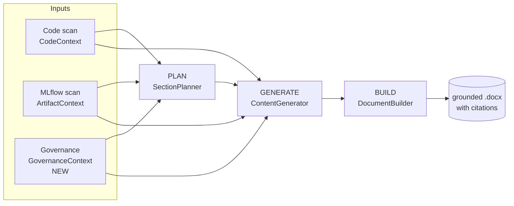
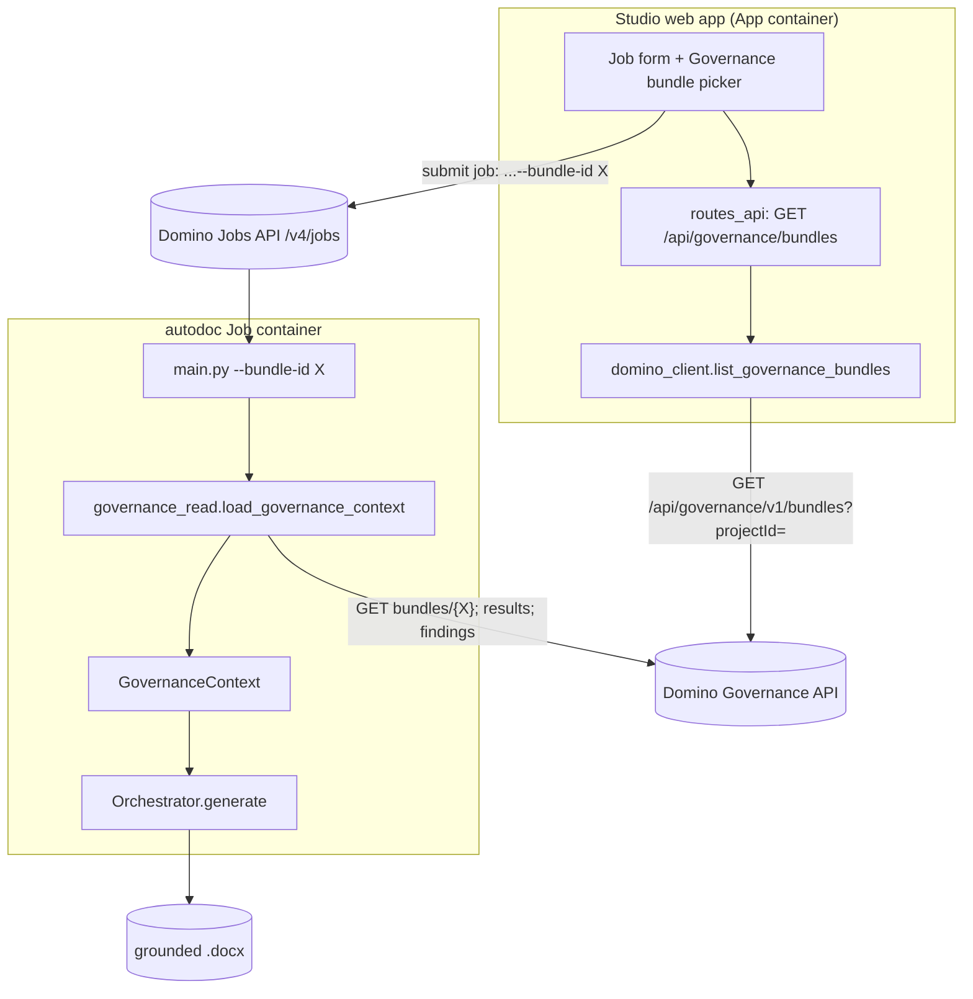
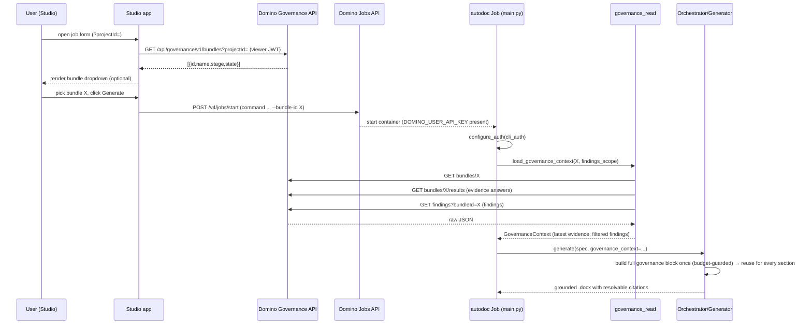
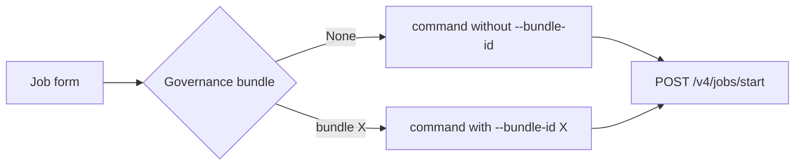

# Governance Context for Auto Model Documentation — Developer Handover

**Target repo:** `dominodatalab/AutoDocumentation_Extension` @ branch `ddl-bira-ignacio.governance`
**Status:** Design handover. Self-contained — a developer can design and build from this without further questions, except the single bounded item in [§11 Open items](#11-open-items--confirm-before-coding).
**Diagrams:** Mermaid (render in GitHub/VS Code preview).

---

## Table of contents

1. [Context &amp; problem](#1-context--problem)
2. [What &#34;Domino Governance context&#34; means here](#2-what-domino-governance-context-means-here)
3. [Scope](#3-scope)
4. [How the existing pipeline works (background)](#4-how-the-existing-pipeline-works-background)
5. [Solution architecture](#5-solution-architecture)
6. [Data contracts](#6-data-contracts)
7. [Prompt engineering spec (literal)](#7-prompt-engineering-spec-literal)
8. [Implementation guide (file-by-file)](#8-implementation-guide-file-by-file)
9. [Studio UI: bundle picker](#9-studio-ui-bundle-picker)
10. [Test plan](#10-test-plan)
11. [Open items — confirm before coding](#11-open-items--confirm-before-coding)

---

## 1. Context & problem

AutoDocumentation generates model documentation by scanning a project's **code** and **MLflow artifacts** and having an LLM write narrative sections, grounded in citable "evidence" facts (`[@code.*]`, `[@mlflow.*]`).

**The gap:** the tool has **no awareness of the Domino Governance bundle** the model is being documented for. Risk tier, intended use, validation status, approval state, and any raised issues are therefore *inferred* by the LLM instead of grounded in the governing record.

**This feature** feeds real governance context into generation so the narrative is grounded in — and cites — the bundle's actual record:

- **Bundle** identity + policy + current stage/state.
- **Evidence** (the answered policy questions — latest answer per question).
- **Findings** (issues raised against the bundle).

These become **citable facts woven into the relevant sections** (`[@evidence.*]`, `[@finding.*]`, `[@governance.*]`) — exactly how code/MLflow facts already work. No new doc sections. The LLM is instructed to treat governance facts as verbatim ground truth.

---

## 2. What "Domino Governance context" means here

Domino Governance manages the model-risk lifecycle. Entities the developer must know:

| Entity                       | Meaning                                                                                                                                                                               | API base                                                              |
| ---------------------------- | ------------------------------------------------------------------------------------------------------------------------------------------------------------------------------------- | --------------------------------------------------------------------- |
| **Governed Bundle**    | A package tying a project/model to a governance**policy** that moves through lifecycle **stages** (Draft → Review → Approved…). Holds evidence, findings, attachments. | `/api/governance/v1/bundles`                                        |
| **Policy**             | Defines the stages and, per stage, an `evidenceSet` of required **questions** (artifacts).                                                                                    | `/api/governance/v1/policies/{id}/definition`                       |
| **Evidence / Results** | Stakeholders'**answers** to policy questions. Answers can be revised → multiple over time. **We take the latest per question.**                                          | `/api/governance/v1/bundles/{id}/results` *(confirm — see §11)* |
| **Findings**           | Issues/observations raised against a bundle, with severity + status; can be resolved/dismissed.                                                                                       | `/api/governance/v1/findings` *(confirm — see §11)*             |
| **Attachments**        | Files attached to the bundle (e.g. the generated `.docx`). Out of scope here.                                                                                                       | `/api/governance/v1/bundles/{id}/attachments`                       |

Note : Governance API base path is `/api/governance/v1/` (NOT `/v4/`).

## 3. Scope

**In scope**

- A `--bundle-id` CLI flag on the autodoc Job. When present, the Job fetches bundle + latest evidence + findings itself and threads them through generation as citable facts.
- A new typed `GovernanceContext` model.
- A governance read client (Job-side) + a Studio list endpoint (app-side) for a bundle picker.
- Prompt + citation wiring so governance facts render with resolvable citations.
- Spec-driven findings filter (the doc spec decides scope; default = open/unresolved only).

**Out of scope**

- Writing the generated doc back to the bundle as an attachment.
- Auto-creating findings from generation gaps.
- Full evidence revision history (we keep latest-only by design).
- Dedicated "Evidence" / "Findings" doc sections (surfacing is citation-woven only).

**Decisions already made :**  Job fetches directly (no external Portal, no context file); citable-facts-woven-in; findings scope is spec-driven.

---

## 4. How the existing pipeline works

The orchestrator runs a 4-phase pipeline — SCAN → PLAN → GENERATE → BUILD. Governance context enters as a **third context source** alongside code and MLflow (the diagram's *Inputs* are the SCAN-phase outputs), and rides the existing citation machinery.



Key existing seams (canonical repo, `auto_model_docs/`):

- `autodoc/core/models.py` — `GenerationContext` is the per-section bundle of context handed to generators. `Citation`. `CodeContext`/`ArtifactContext`/`CodeEvidence` dataclasses. `DocumentSpec`/`SectionSpec`.
- `autodoc/generation/generator.py` — `ContentGenerator` formats evidence into prompt blocks: `_format_code_evidence(context.code_context)` and `_format_mlflow_evidence(context)`, passes them as `code_evidence=`/`mlflow_evidence=` to `build_*_prompt(...)`, then resolves `[@id]` markers via `_collect_citations_for_text/table/chart`.
- `autodoc/llm/prompts.py` — `build_narrative_prompt`, `build_table_prompt`, `build_chart_prompt`, `build_list_prompt`. Each already accepts `code_evidence`/`mlflow_evidence` string params and splices them under "Additional Context".
- `autodoc/generation/citations.py` — `build_code_citation_id`, `build_mlflow_citation_id`, `parse_citation_id`, `extract_citation_ids`. This is the citation registry the new governance IDs plug into.
- `autodoc/orchestrator.py` — `Orchestrator.__init__` + `generate(spec, on_progress, on_status)` (no bundle context today).
- `auto_model_docs/main.py` — Click CLI entry (no `--bundle-id` today).
- `auto_model_docs/domino_client.py` — `_domino_request(method, path, *, json, params)` httpx helper with retry; `resolve_project`, `get_project_context`, `browse_code`, `submit_job(...)`, `build_job_url`.
- `auto_model_docs/domino_auth.py` — `configure_auth(provider)`, `current_auth().to_headers()`, providers `user_auth()` (JWT, Studio) and `cli_auth()` (API key, Job), `resolve_api_host()` = `DOMINO_API_PROXY` > `DOMINO_API_HOST`.
- `auto_model_docs/studio/job_engine.py` — `_parse_request` → `JobRequest`, `_build_job_command` builds the CLI arg list, `_submit_domino_job`.

The design mirrors the **code/MLflow evidence path end-to-end**, so governance facts inherit citation rendering and the anti-fabrication discipline for free. The full governance block is passed to every section (see §7.4 — no per-section filtering in v1).

---

## 5. Solution architecture

### 5.1 System context



### 5.2 End-to-end sequence



### 5.3 Component responsibilities

| Component                                                                                            | New/changed   | Responsibility                                                                                                                                                          |
| ---------------------------------------------------------------------------------------------------- | ------------- | ----------------------------------------------------------------------------------------------------------------------------------------------------------------------- |
| `autodoc/governance_read.py`                                                                       | **NEW** | Job-side reads via `_domino_request`; bundle/evidence/findings → `GovernanceContext`; latest-answer dedup; findings filter; never hard-fails.                      |
| `autodoc/core/models.py`                                                                           | changed       | `EvidenceItem`, `Finding`, `GovernanceContext` dataclasses; `GenerationContext.governance_context`; `DocumentSpec.governance_findings_scope`.                 |
| `autodoc/generation/citations.py`                                                                  | changed       | `build_evidence_citation_id`, `build_finding_citation_id`, `build_governance_citation_id`; teach `parse_citation_id`/`extract_citation_ids` the new prefixes. |
| `autodoc/llm/prompts.py`                                                                           | changed       | `governance_evidence` param on the 4 `build_*_prompt`s; governance anti-fabrication clause; system-prompt note.                                                     |
| `autodoc/generation/generator.py`                                                                  | changed       | `_format_governance_evidence(context)`; pass `governance_evidence=`; resolve governance citations.                                                                  |
| `autodoc/orchestrator.py`                                                                          | changed       | accept + thread the full `governance_context` into every section (no per-section filter); apply the token-budget guard once (§7.4).                                  |
| `auto_model_docs/main.py`                                                                          | changed       | `--bundle-id`, `--findings-scope`; configure cli_auth; load context; pass to Orchestrator.                                                                          |
| `auto_model_docs/domino_client.py`                                                                 | changed       | `list_governance_bundles(project_id)` for the picker.                                                                                                                 |
| `studio/routes_api.py`, `studio/state.py`, `studio/job_engine.py`, `studio/ui_components.py` | changed       | bundle list route;`JobRequest.bundle_id`; `--bundle-id` in command; dropdown UI.                                                                                    |

---

## 6. Data contracts

### 6.1 Governance API reads (Job-side)

All under `{DOMINO_API_HOST}/api/governance/v1/`, via `domino_client._domino_request("GET", path, params=...)` after `configure_auth(cli_auth)`. **Parse defensively** (multi-key fallback) — the repo convention assumes response shapes vary by deployment. Exact paths/field names are the one item to confirm (§11); the shapes below are the design target.

**(a) Bundle** — `GET /api/governance/v1/bundles/{bundle_id}`

```jsonc
{
  "id": "b94e8f84-…",
  "name": "Credit Risk v3 — MDD",
  "projectId": "…",
  "policyName": "Model Lifecycle",          // or nested policy.{name}
  "stage": "Validation",                     // current stage
  "state": "Active",                         // bundle state/status
  "riskTier": "High",                        // optional governance facts
  "owner": "alice.chen"
}
```

**(b) Evidence / results** — `GET /api/governance/v1/bundles/{bundle_id}/results`

```jsonc
{
  "results": [
    {
      "id": "r-001",
      "evidenceId": "q-intended-use",        // stable question id (dedup key)
      "label": "Intended use",               // the question text
      "value": "Retail credit underwriting decisions.",  // the answer
      "stage": "Intake",
      "updatedAt": "2026-05-02T11:04:00Z",   // recency → "latest"
      "version": 3
    }
  ]
}
```

**Latest-per-question rule:** group by `evidenceId` (fallback `label`), keep the entry with the greatest `updatedAt` (fallback greatest `version`, fallback last in list).

**(c) Findings** — `GET /api/governance/v1/findings?bundleId={bundle_id}`

```jsonc
{
  "findings": [
    {
      "id": "f-010",
      "title": "Missing sensitivity analysis",
      "description": "No stress test evidence for the macro scenario.",
      "severity": "S2",                      // or High/Medium/Low
      "status": "open"                        // open|in_progress|resolved|closed|dismissed
    }
  ]
}
```

**(d) List bundles for a project (Studio picker)** — `GET /api/governance/v1/bundles?projectId={project_id}`

A project can hold **multiple** bundles, so this returns a list (paginated). The picker must disambiguate, so surface enough per bundle to tell them apart.

```jsonc
{
  "bundles": [
    {
      "id": "b94e8f84-…",
      "name": "Credit Risk v3 — MDD",
      "policyName": "Model Lifecycle",
      "stage": "Validation",
      "state": "Active",
      "modelName": "credit_risk",      // if bundles are model-scoped (confirm — §11)
      "modelVersion": "3",
      "updatedAt": "2026-05-20T09:00:00Z"
    }
  ],
  "nextPageToken": "…"                 // or offset/limit — handle pagination
}
```

- **Pagination:** follow the deployment's convention (page token or `offset`/`limit`); fetch all pages so no bundle is hidden.
- **Sort:** most-recently-updated first.
- The Job-side reads (a–c) take a single `bundle_id` — the **one** the user picked (or passed via `--bundle-id`).

### 6.2 Typed models — `autodoc/core/models.py`

```python
@dataclass
class EvidenceItem:
    question_id: str
    question: str
    answer: str
    stage: Optional[str] = None
    answered_at: Optional[str] = None

@dataclass
class Finding:
    finding_id: str
    title: str
    description: str = ""
    severity: Optional[str] = None
    status: str = "open"

@dataclass
class GovernanceContext:
    bundle_id: str
    bundle_name: Optional[str] = None
    policy_name: Optional[str] = None
    stage: Optional[str] = None
    state: Optional[str] = None
    risk_tier: Optional[str] = None
    owner: Optional[str] = None
    evidence: List[EvidenceItem] = field(default_factory=list)
    findings: List[Finding] = field(default_factory=list)
```

- `GenerationContext` (~L452) gains `governance_context: Optional[GovernanceContext] = None`.
- `DocumentSpec` (~L227) gains `governance_findings_scope: Literal["open", "all"] = "open"` — overridable in a spec YAML (e.g. a validation spec sets `governance_findings_scope: all`).

### 6.3 Findings scope filter (spec-driven)

`load_governance_context(bundle_id, *, findings_scope)`:

- `"open"` → keep findings whose `status.lower()` ∉ `{"resolved","closed","dismissed"}`. **(Confirm status vocabulary — §11.)**
- `"all"` → keep everything.
  Precedence: CLI `--findings-scope` (if given) overrides `DocumentSpec.governance_findings_scope`, which overrides the default `"open"`.

### 6.4 Auth contract

- **Job**: `main.py` calls `domino_auth.configure_auth(cli_auth)` only on the `--bundle-id` path. `cli_auth()` reads `DOMINO_USER_API_KEY`/`DOMINO_API_KEY` (auto-injected into Domino Job containers) → `X-Domino-Api-Key`. All reads then flow through `_domino_request` unchanged.
- **Studio**: the app already configures `user_auth` (viewer JWT). `list_governance_bundles` reuses `_domino_request` → viewer identity, project-scoped.
- Governance reads are **additive**: any failure (404, 403, network) logs a warning and yields `None`/empty — generation proceeds without governance context, never crashes.

---

## 7. Prompt engineering spec (literal)

Governance facts must reach the LLM as a citation-tagged block, parallel to the existing code/MLflow evidence blocks, and the model must be told to treat them as verbatim truth.

### 7.1 Governance evidence block — produced by `_format_governance_evidence`

Return `""` when `governance_context is None` (keeps non-governance prompts byte-identical). Otherwise emit exactly:

```
## Governance Evidence (factual grounding from the Domino governance bundle — cite verbatim where relevant)
Use the citation IDs in [@brackets] when quoting these facts. These are the source of truth for
risk classification, intended use, validation status, approval state, and any raised issues.

[@governance.bundle]: Credit Risk v3 — MDD
[@governance.policy]: Model Lifecycle
[@governance.stage]: Validation
[@governance.state]: Active
[@governance.risk_tier]: High
[@governance.owner]: alice.chen

Evidence (latest answer per policy question):
[@evidence.intended_use]: Intended use — "Retail credit underwriting decisions."
[@evidence.data_sources]: Data sources — "Bureau data + internal application records, 2019–2025."

Findings (open):
[@finding.f-010]: [S2] Missing sensitivity analysis — No stress test evidence for the macro scenario.
```

- Citation IDs: `governance.<key>`, `evidence.<slug(question_id)>`, `finding.<finding_id>`. Slug = lowercase, non-alphanumerics → `_`.
- Omit any subsection that is empty (no evidence → drop the "Evidence" block; no findings → drop "Findings").
- The same block is built once and passed to **every** section (§7.4). Token trimming (per-answer truncation + total cap, evidence-only) happens here per §7.4 — bundle facts and findings are never dropped.

### 7.2 Anti-fabrication clause

Add to each content prompt's instructions (one canonical string; do not duplicate-with-drift):

```
- Any model risk classification, validation status, regulatory mapping, approval state, or
  intended-use claim must come VERBATIM from the Governance Evidence block above. Do not infer
  these from code or MLflow. Cite them with [@governance.*]/[@evidence.*].
- When you state or rely on an open finding, cite it with [@finding.*]. Do not invent findings.
- Do not fabricate evidence answers; if a fact is not in the Governance Evidence block, omit it.
```

### 7.3 System prompt note

Append to `SYSTEM_NARRATIVE_WRITER` (the narrative system prompt) one sentence:

```
Treat the Governance Evidence block as the authoritative source for governance facts (risk tier,
intended use, validation status, approval state, findings); never override it with inferences.
```

### 7.4 Distribution into sections — tiered pass-all (no per-section filtering in v1)

**Decision:** every section receives the **same, full** (scope-filtered) governance context — we do **not** filter which governance facts go to which section by keyword or by spec. The LLM decides what is relevant per section and cites accordingly. Rationale: per-section keyword filtering is brittle and its worst failure — *silently dropping a finding because a section was named "Caveats" instead of "Limitations"* — is unacceptable for an MRM-grade tool. Determinism and auditability win over prompt slimming at this stage.

The only governance content that varies by *bundle* (not by section) is the **findings open/all scope** (§6.3) and the **token-budget guard** below. Nothing is section-specific.

#### What each section's prompt gets

The complete `_format_governance_evidence(context)` block (§7.1): all bundle/policy/stage facts + all in-scope evidence (latest per question) + all in-scope findings. Identical block for every section. The block is built once per generation and reused, so there is no per-section relevance helper to write or maintain.

#### Token-budget guard (the only trimming applied)

Mature bundles can carry 60+ Q&A pairs (PRD risk R2). Apply, in order, *before* the block is built — never section-aware:

1. **Per-answer truncation:** truncate any single evidence answer / finding description to ~400 chars with an ellipsis.
2. **Hard total cap:** cap the whole governance block at a configurable budget (default **~6,000 tokens**, env `AUTODOC_GOV_CONTEXT_TOKEN_BUDGET`). If the block exceeds the cap after step 1, drop **evidence** items (lowest-priority first: oldest `answered_at` first) until under budget — **bundle facts and findings are never dropped** (findings are the risk signal; bundle facts are tiny). Emit a single warning line in the block: `(N evidence items omitted to fit token budget)` so the omission is visible and auditable, never silent.

This guarantees: bundle facts and every in-scope finding always reach every section; only surplus evidence is shed, and only when genuinely over budget, and only with a visible notice.

#### Deferred to v2 (explicitly out of scope now)

Smart per-section relevance — if profiling shows pass-all is too costly on real bundles — should be **deterministic and spec/policy-declared** (the policy already groups evidence by stage), **not** keyword-guessed, and must still guarantee every finding appears in at least one section. Tracked as a v2 enhancement; do not build it in v1. See §11.

### 7.5 Source authority and conflict handling

The governance context and the code/MLflow context own **different domains**. When they say different things the correct behavior is *surface both with attribution* — never silently pick a winner.

#### Domain ownership (what each source is authoritative for)

| Source | Authoritative for | Never overrides |
|---|---|---|
| **Governance** (evidence, findings, bundle facts) | Risk tier, intended use, validation status, approval state, policy framework, reviewer assertions | Code-level technical facts |
| **Code / MLflow** | What is actually implemented: algorithms, libraries, feature engineering, measured metrics | Governance judgments |

These rarely conflict — governance answers "what does the institution say about this model?" and code answers "what does the model actually do?"

#### When they do conflict (overlapping attributes)

A handful of attributes can disagree — declared vs. actual model type, declared vs. actual feature count, claimed framework vs. imported library. The prompt rules for this:

```
- Do not use one source to override or "correct" another. If code and governance evidence
  describe the same attribute differently (e.g. model type, feature count), present BOTH
  with their citations and note the discrepancy explicitly:
  "The code implements XGBoost [@code.x], while the governance record states logistic
  regression [@evidence.model_type]. This discrepancy should be reviewed."
- Do not fabricate a reconciliation. Do not silently choose one source.
- Discrepancies of this kind are significant governance observations, not editorial problems.
```

Add this paragraph to the single canonical anti-fabrication string in §7.2 (not as a separate prompt — keep one canonical block).

#### Finding state → framing, not truth arbitration

A finding's `status` controls **how it is framed in the narrative**, not whether the underlying observation is "true":

| Status | Framing instruction to LLM |
|---|---|
| `open` / `in_progress` | Present as a current limitation or outstanding item. Cite `[@finding.x]`. |
| `resolved` / `closed` | Present as a historical observation that has been addressed (only visible when `--findings-scope all`). |
| `dismissed` | Present as raised but dismissed, with no further editorial judgment (only visible when `--findings-scope all`). |

The LLM does **not** use finding status to decide which of two contradicting facts is correct. A resolved finding that contradicts the code is still a historical governance observation, not evidence the code is right or wrong.

Add the framing table above as a comment in the `_format_governance_evidence` function — it should be rendered as additional instruction text in the block for resolved/dismissed findings when they are included, e.g.:

```
[@finding.f-022]: [S2][RESOLVED] Missing sensitivity analysis — addressed in v3 retesting.
```

#### Disambiguation module (code-vs-evidence consistency check) — deferred to v2

A dedicated conflict-*detection* module (diff declared vs. detected fields, emit discrepancy findings) is the PRD's F10 "code-vs-evidence consistency check" — a heavier Tier-3 feature tracked in §11 as deferred. **Do not build it in v1.** The prompt rules above achieve surfacing; the detector is the v2 upgrade for machine-emitted discrepancy findings.

### 7.6 Worked example (input → block → expected output)

- **Input:** bundle `riskTier=High`, evidence `intended_use="Retail credit underwriting decisions."`, finding `f-010 S2 open`.
- **Block:** as §7.1.
- **Expected doc sentence (Purpose section):** *"The model is classified High risk [@governance.risk_tier] and is intended for retail credit underwriting decisions [@evidence.intended_use]."*
- **Expected doc sentence (Limitations section):** *"An open finding notes the absence of sensitivity analysis for the macro scenario [@finding.f-010]."*
- Citations resolve to `Citation` objects and render in the doc's citation list, identical to code/MLflow citations.

---

## 8. Implementation guide (file-by-file)

Ordered tasks. Each lists files, the change, and acceptance criteria. Build test-first where noted.

### Task 0 — Confirm governance endpoints (§11)

Pull `governance_swagger.json` from the target Domino deployment (or the Portal `domino_client.py` wrapper) and fill the exact paths/field names for bundle, results (evidence), findings. Record them at the top of `governance_read.py`. *Everything else is fully specified and can proceed in parallel against the §6 shapes + fixtures.*

### Task 1 — Models + citation IDs (pure, test-first)

- **Files:** `autodoc/core/models.py`, `autodoc/generation/citations.py`.
- Add `EvidenceItem`/`Finding`/`GovernanceContext`; extend `GenerationContext` + `DocumentSpec` (§6.2).
- Add `build_evidence_citation_id(qid)`, `build_finding_citation_id(fid)`, `build_governance_citation_id(key)`; extend `parse_citation_id`/`extract_citation_ids` to recognize `evidence.`/`finding.`/`governance.`.
- **Accept:** round-trip unit tests for each id builder/parser; `GovernanceContext` constructs with defaults.

### Task 2 — Governance read client

- **File:** `autodoc/governance_read.py` (NEW).
- `fetch_bundle(bundle_id)`, `fetch_evidence(bundle_id)` (latest-per-question dedup), `fetch_findings(bundle_id)`, `load_governance_context(bundle_id, *, findings_scope) -> Optional[GovernanceContext]`. Reuse `domino_client._domino_request`. Catch all exceptions → log + return `None`/empty.
- **Accept:** unit tests against recorded JSON fixtures — dedup keeps latest; scope filter drops resolved when `open`; 404/403 → `None` (no raise).

### Task 3 — Prompt + generator wiring

- **Files:** `autodoc/llm/prompts.py`, `autodoc/generation/generator.py`.
- Add `governance_evidence: str = ""` param to the 4 `build_*_prompt`s; splice under "Additional Context"; add §7.2 clause + §7.3 system note.
- Add `ContentGenerator._format_governance_evidence(context)` (§7.1); pass its output as `governance_evidence=` at each `build_*_prompt` call; extend `_collect_citations_for_text/table/chart` to resolve governance ids into `Citation`s.
- **Accept:** prompt builders include the block when given; empty governance → byte-identical to today; a `[@evidence.x]` marker in generated text resolves to a `Citation`.

### Task 4 — Orchestrator + CLI

- **Files:** `autodoc/orchestrator.py`, `auto_model_docs/main.py`.
- `Orchestrator.__init__`/`generate(...)` accept `governance_context=None`; set the **same** full `governance_context` on every section's `GenerationContext` (no per-section filter). Apply the §7.4 token-budget guard once (per-answer truncation + total cap, evidence-only, with the visible omission notice).
- `main.py`: add `--bundle-id` (str) and `--findings-scope` (choice `open|all`, default unset→spec). When `--bundle-id` set: `configure_auth(cli_auth)`, `gov = governance_read.load_governance_context(...)`, pass to Orchestrator.
- **Accept:** CLI without `--bundle-id` unchanged; with it, governance facts appear in generated sections; integration run produces resolvable citations; bundle facts + every in-scope finding are present regardless of bundle size.

### Task 5 — Studio bundle picker

- **Files:** `domino_client.py`, `studio/routes_api.py`, `studio/state.py`, `studio/job_engine.py`, `studio/ui_components.py`.
- `domino_client.list_governance_bundles(project_id)` via `_domino_request` — **paginate** (fetch all pages) and **sort most-recently-updated first** (§6.1d); new read-only route `GET /api/governance/bundles`; `JobRequest.bundle_id`; parse in `_parse_request`; append `--bundle-id` (+ `--findings-scope`) in `_build_job_command`; dropdown in the form (§9).
- **Accept:** a project with several bundles lists them all, disambiguated and newest-first, with no auto-selection; picking one puts `--bundle-id <id>` in the submitted command; "None" omits the flag and reproduces today's behavior.

---

## 9. Studio UI: bundle picker

An **optional** "Governance bundle" single-select on the existing job form (follows the hardware-tier/environment select pattern in `ui_components.py`). A project can have **multiple** bundles, so the picker is built to disambiguate, not to assume one. Per the Domino design rules:

- Label above field (sentence case): "Governance bundle". Helper/caption: "Ground the document in this bundle's evidence and findings. Optional."
- **Multiple bundles (including several on the *same model*):** a model legitimately has multiple bundles — across lifecycle cycles (initial approval → annual revalidation), across model versions, and across policies/frameworks. List **all** of the project's bundles, **active first, then most-recently-updated**. Each option shows enough to pick the *right* one — `"<bundle name> · <policy> · <stage> · <state>"` (and model/version when bundles are model-scoped); full detail in a tooltip on truncation.
- **Never auto-pick.** When several bundles exist, do not pre-select one. The default selection is the explicit empty option **"None — generate without governance context"** (the actionable empty state). The user chooses deliberately; one run documents exactly one bundle.
- **Single bundle:** still requires an explicit choice (don't silently default to it) — but it's fine to make selecting it one click.
- **A model can have more than one *active* bundle at once** (concurrent policies/frameworks, and versions in flight). So "active-first" sort is a convenience, **not** a unique-result guarantee — never collapse the active set to a single auto-pick. Among active bundles, **policy** and **version** are the disambiguators; show them on the option. (What's typically unique is one active bundle per *(model, policy, version)* — confirm in §11.)
- **Warn on non-active bundles.** If the user selects a bundle whose state is closed/archived/superseded, show a non-blocking inline note: "This bundle is `<state>` — the document will reflect its evidence as of `<updatedAt>`, which may not match the current model." Documenting a historical bundle is valid (e.g. regenerating last year's MDD), so warn, don't block.
- **Match the bundle to the document (guidance, not enforcement).** The bundle's policy/purpose should fit the doc being produced (a development bundle for an MDD, a validation bundle for a VR, etc.). Surface policy/purpose in the option so the user self-selects correctly; do **not** hard-filter by doc type (that would hide valid choices and depends on a fuzzy policy→doc-type mapping). A soft hint/sort by likely-relevant policy is an acceptable enhancement.
- **Version-mismatch awareness.** When bundles are model-version-scoped, showing the version in the option helps the user avoid documenting current code against an old-version bundle. (We don't reconcile this automatically; governance facts are cited verbatim and may legitimately differ from code — surfacing the version is the mitigation.)
- It is a **secondary** field — the form's single primary action ("Generate documentation") is unchanged. Place it in the optional/advanced group.
- Empty list state (no bundles in project): show "No governance bundles in this project" with a tooltip linking to how bundles are created — do not show a dead dropdown.
- Errors fetching bundles: non-blocking inline note ("Couldn't load governance bundles — you can still generate without one"), generation stays available.

> **One doc = one bundle — this constraint is intentional, do not relax it in v1.**
>
> A bundle is the single verbatim source of truth for governance facts. Merging two bundles creates fact collisions (e.g. `risk_tier = High` from one, `risk_tier = Medium` from another), makes `[@evidence.*]` citations ambiguous, and breaks provenance (which bundle does this document evidence/attach back to?). The anti-fabrication guarantee only holds when there is exactly one governing record.
>
> Models under several frameworks → several runs → several documents, each cleanly tied to its bundle. A consolidated cross-bundle report is a deliberate v2 feature gated to consolidated doc types — not a flag on this pipeline.



---

## 10. Test plan

| Layer       | Test                                                     | Asserts                                                                                                                                                                                                                           |
| ----------- | -------------------------------------------------------- | --------------------------------------------------------------------------------------------------------------------------------------------------------------------------------------------------------------------------------- |
| Unit        | `tests/test_governance_read.py` (fixtures from Task 0) | latest-answer dedup; findings scope filter; 404/403 →`None`, no raise                                                                                                                                                          |
| Unit        | `tests/test_citations.py` (extend)                     | governance/evidence/finding id round-trip;`extract_citation_ids` finds new prefixes                                                                                                                                             |
| Unit        | `tests/test_prompts*.py` (extend)                      | `governance_evidence` block present when given; empty → unchanged prompt; anti-fabrication clause present                                                                                                                      |
| Unit        | `tests/test_models.py` / orchestrator test             | the**full** `GovernanceContext` reaches every section's `GenerationContext` (no per-section drop)                                                                                                                       |
| Unit        | budget-guard test                                        | over-budget bundle: per-answer truncation applied; surplus evidence shed oldest-first with the omission notice;**bundle facts + all findings retained**                                                                     |
| Integration | CLI                                                      | `main.py --spec spec-templates/doc_spec.yaml --code-root <sample> --bundle-id <test>` against a dev Domino bundle → `.docx` contains governance-grounded, cited statements; omitting `--bundle-id` reproduces prior output |
| Unit        | `list_governance_bundles` (paginated fixture)          | multiple bundles across pages all returned; sorted newest-first                                                                                                                                                                   |
| Manual      | Studio (multi-bundle project)                            | project with ≥2 bundles lists all, disambiguated, no auto-selection; pick one → command includes `--bundle-id`; "None" omits it; run produces grounded doc                                                                    |

**Fixtures to capture in Task 0:** one bundle JSON, one results JSON with a revised answer (two entries same `evidenceId`, different `updatedAt`), one findings JSON mixing `open` + `resolved`.

---

## 11. Open items — confirm before coding

Single bounded dependency. Resolve in Task 0; does not block parallel work on Tasks 1–5 (which target the §6 shapes via fixtures).

1. **Exact governance read endpoints + field names** — confirm against the deployment's `governance_swagger.json` (or Portal's `domino_client.py`):
   - Evidence/results path: `bundles/{id}/results` vs `results?bundleId=` — and the **dedup key** field (`evidenceId`? `definitionId`?) + recency field (`updatedAt`? `version`?).
   - Findings path: `findings?bundleId=` vs `bundles/{id}/findings` — and the **status vocabulary** (which values mean "resolved/closed/dismissed").
   - Bundle stage/state/risk-tier field names.
   - **List-bundles** (§6.1d): pagination convention (page token vs `offset`/`limit`).
2. **Bundle cardinality & scoping** — confirm against the deployment:
   - A project can have **multiple** bundles (assumed yes).
   - A single **model** can also have **multiple** bundles — across lifecycle cycles (annual revalidation), across model **versions**, and across **policies/frameworks**. Confirm which of these your instance actually produces, since it drives the disambiguation fields the picker must show.
   - Are bundles **project-scoped or model-scoped**, and what field links a bundle to its registered **model + version**? Does a bundle expose a **state** (active/closed/archived/superseded)? These drive the picker's grouping, the active-first sort, the non-active warning, and the version display (§6.1d, §9).
   - **Active-bundle uniqueness:** is at most **one** bundle active per *model*, or only per *(model, policy, version)*? (Realistically the latter — a model can have several active bundles across concurrent policies and in-flight versions.) This decides whether the picker may ever safely **pre-highlight** a single active bundle. If active is not unique per model, keep selection fully manual (the v1 default).
   - Does **not** block v1 — the picker lists all project bundles, disambiguated, with no auto-selection. Model-aware grouping/filtering and doc-type hinting are enhancements.
3. **Token-budget defaults** (§7.4): the ~400-char per-answer truncation and ~6,000-token total cap (`AUTODOC_GOV_CONTEXT_TOKEN_BUDGET`) are starting values. Confirm or tune once real bundle sizes are known; the alternative (LLM summarization of long answers instead of truncation) is a v2 option.

If endpoints differ, only `governance_read.py`'s parsing changes — the architecture, models, prompts, and citations are unaffected.

### Deferred to v2 (not in this build)

- **Smart per-section relevance** for governance facts — only if profiling shows tiered pass-all is too costly on real bundles. Must be deterministic and spec/policy-declared (not keyword-guessed) and must still guarantee every finding appears in at least one section (§7.4).
- **Consolidated multi-bundle documents** — selecting several bundles for one document. Only if a real cross-framework/portfolio report need emerges. Requires: multi-select UI, **per-bundle namespaced facts** (`[@evidence.<bundle>.x]`, never merged), prompt framing them as distinct governance contexts, explicit per-fact attribution in the doc, and gating to consolidated doc types. **Not** a flag on the single-bundle pipeline — fact-merging is explicitly rejected (breaks single-source-of-truth, citations, and attach-back).
- **Code-vs-evidence consistency check / disambiguation module** (PRD F10) — a deterministic pre-pass that diffs declared (governance) vs. detected (code/MLflow) fields — model type, framework, feature count — and **emits discrepancy findings**, rather than relying on the LLM to surface them in prose. v1 handles conflicts at the prompt level only (§7.5: present both, attribute, never resolve). This module is the upgrade for machine-emitted, dashboard-visible discrepancies. Do **not** build a conflict *resolver* (auto-picking a winner) — surfacing/flagging is correct, silent resolution is not.
