# How to use Model Docs

Model Docs generates Word documents and Jupyter notebooks for your ML models. Open it from your Domino project sidebar.

## Before you start

- Model Docs must be installed on your project (Extensions in the left sidebar).
- Your project needs registered models, code, or MLflow experiments to document.
- LLM API keys must be set on the as project or user environment variables used for generation jobs. ANTHROPIC_API_KEY and OPENAI_API_KEY are supported (see Advanced Options)

## 1. Open Model Docs

Go to your project **Overview**. In the left sidebar, click the **Model Docs** extension link.

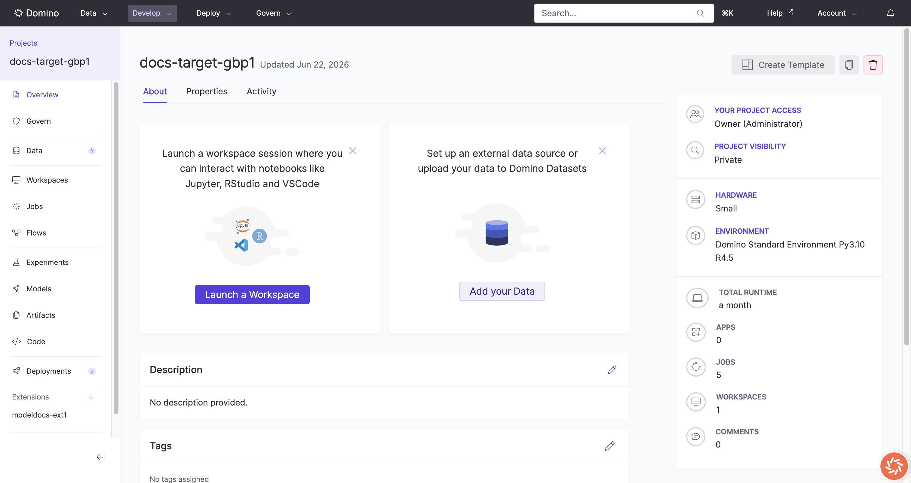

The Model Docs studio opens inside your project.

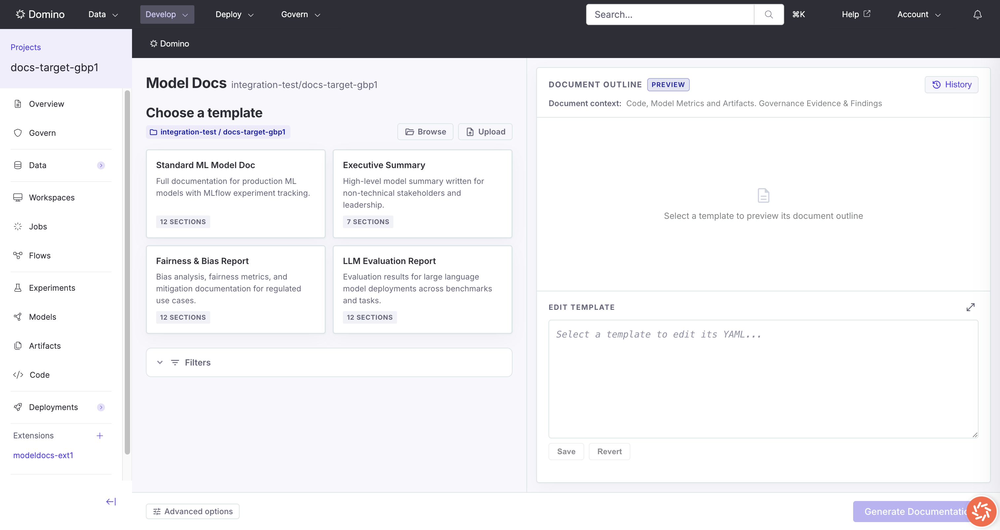

## 2. Choose a template

Pick a built-in template from the gallery. The document outline and YAML editor load on the right.

You can also:

- **Browse** to copy a YAML spec from project code or a dataset.
- **Upload** a YAML file from your computer.

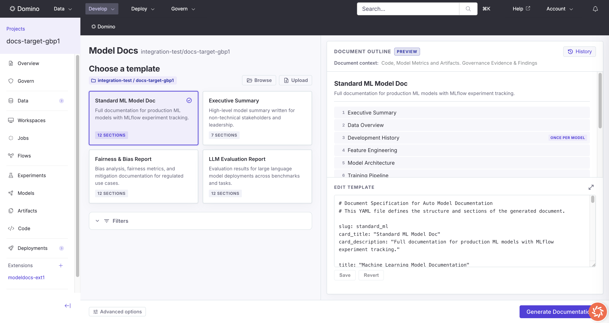

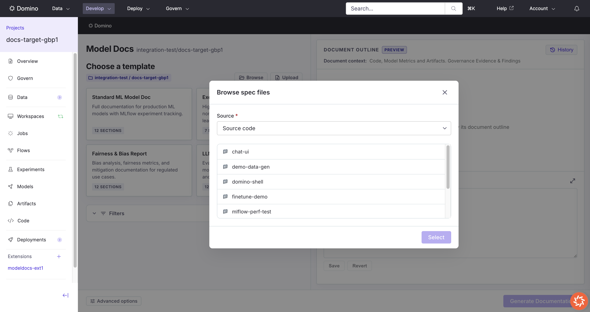

To change section order or wording rules, edit the YAML in **Edit template**, then click **Save**.

## 3. Set filters (optional)

Expand **Filters** to limit which models are documented.

| Field | What it does |
|-------|----------------|
| Model names | Comma-separated names. Use `*` as a wildcard. |
| Experiment names | Comma-separated MLflow experiment names. |
| Latest version only | Document only the latest model version. |

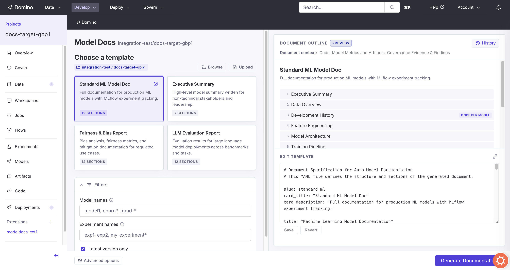

If your project uses Domino Governance, pick a **Governance bundle**. Models linked to that bundle are always included.

## 4. Advanced options (optional)

Click **Advanced options** to change job settings.

| Field | What it does |
|-------|----------------|
| Branch | Git branch for the job (Git-based projects only). |
| Code path | Which code directory to analyze. |
| Hardware tier | Compute tier for the generation job. |
| Provider / Model | LLM provider and model name. |
| Provider API base URL | Override the default API endpoint. |

Click **Done** when finished.

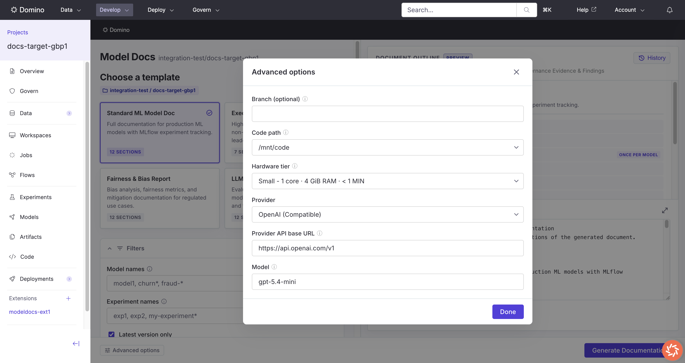

## 5. Generate documentation

Click **Generate Documentation**.

Model Docs submits a Domino job in your project. The results screen shows progress while the job runs.

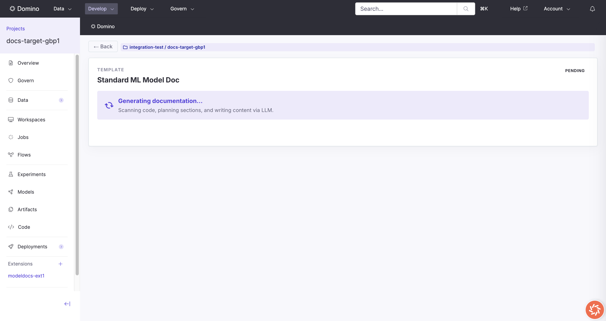

When the job finishes, you see a success message and an inline preview of the Word document.

Click **Open AutoDoc file** to open the output folder.

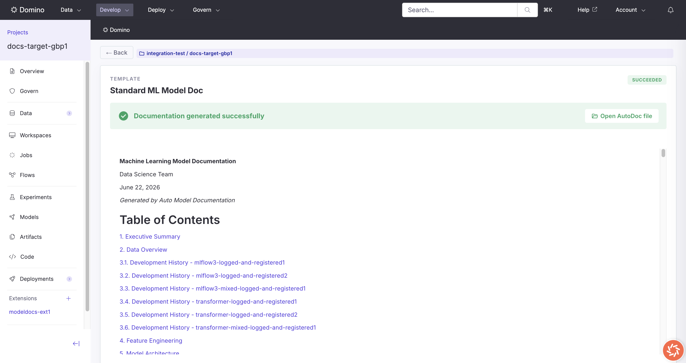

## 6. Check history

Click **History** (top right on the main screen, or the **History** section on the results screen).

Each row shows status, time submitted, links to the output files, and the Domino job.

- **Open** goes to the generated files.
- **Preview** shows the document in Model Docs.
- **View** opens the job logs.

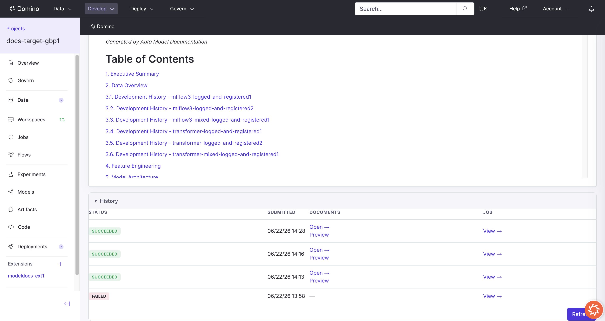

## 7. Open the generated files

The output folder contains:

- `model_docs.docx` - the Word document
- `model_docs.ipynb` - an editable Jupyter notebook

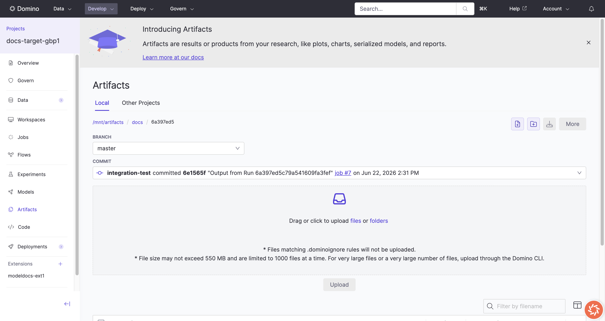

You can also reach this folder from **Open AutoDoc file** on the results screen or **Open** in history.

## 8. Edit the document in the notebook

1. Open `model_docs.ipynb` from the output folder (click the file name in Artifacts).
2. Review the rendered notebook. Each section has markdown and code cells you can change.
3. To edit interactively, open the notebook in a **Workspace** (Jupyter). In the file browser, go to `/mnt/artifacts/docs/<run-folder>/model_docs.ipynb`.
4. Change text, charts, or tables as needed. Re-run cells to refresh outputs.
5. Scroll to the **last cell** and run it. That exports your changes back to `model_docs.docx` in the same folder.

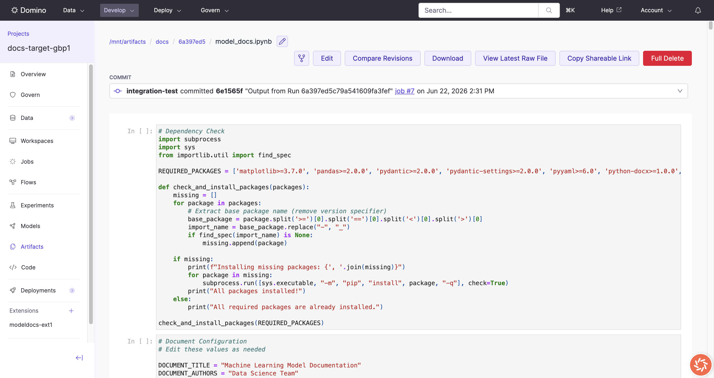

The in-app preview in Model Docs shows the Word document only. Use the notebook for edits.

## Quick reference

```
Open Model Docs from project sidebar
  -> pick a template (or Browse / Upload)
  -> set filters and governance bundle if needed
  -> Advanced options if needed
  -> Generate Documentation
  -> wait for success
  -> Open AutoDoc file
  -> edit model_docs.ipynb in a Workspace
  -> run the export cell -> updated model_docs.docx
```

## Troubleshooting

| Problem | What to check |
|---------|----------------|
| **Generate Documentation** is disabled | Select a template first. If governance bundles exist, pick one. |
| Job fails | Open **View** in history and read the job logs. |
| Preview is empty | Wait for the job to finish. The Word file may still be writing. |
| No models in the document | Widen or clear the model name filter. |
